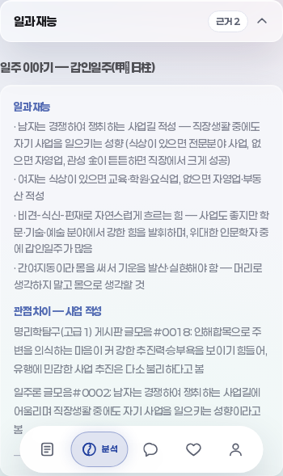
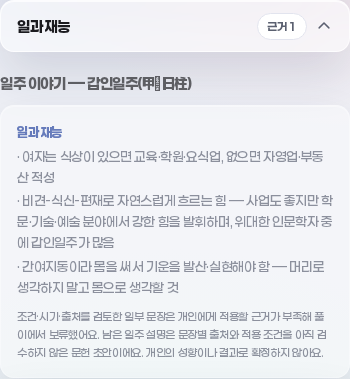

# 기본 풀이 문장 — 보류·출처 소비 계약

2026-09-28 · 사용자 원문66. 기준은 PR #210 merged/main `931f81c6acc852316c48272a3cd691d8c8d481ec`, tree `92bf06d19cba09caef8df4a4f65295862f69f47d`다.

검토14항목(갑인6·갑오4·갑자4, 문자열12·견해그룹2)을 개인풀이에서 보류한다. 원문·KB 초안은 그대로 두고 검수상태·조건·예외·시기·계보·DOCX 위치를 리포트에 보존한다. 일주의 첫 자료명을 각 문장의 출처로 자동 부착하지 않는다. 나머지 일주 설명은 **문장별 출처와 적용 조건을 아직 검수하지 않은 문헌 초안**으로 표시한다.

완전검수 일주0, 성격 검토4/402, 개인 적용·학습 적격0, 확률null이다. 이번 변경은 선택 문구의 전달 계약이며 의미가 유사한 모든 문장·전체60일주의 안전성이나 개인 해석 정확도를 인증하지 않는다. 관리 진행률은9/20=45% 유지다.

## 1. 구현한 경계

| 경로 | 현재 계약 |
|---|---|
| 정본 `basicSentences.js` → `report.js` | 14항목의 NFC/공백 정규화 전체문구를 제거. 견해 한쪽이 일치하면 그룹 전체 보류. 원문/KB 객체 불변, 재적용해도 같은 메타/안내 |
| `basicReview.reviewed` | 검토 ID·초안 포인터·조건/예외·원문 유닛/제목/계보·본문/XML 문단을 함께 전달. 원문 존재를 개인 적용 승인으로 바꾸지 않음 |
| `sentences` | 남은 핵심/성격 등 문자열에 `unreviewed`, `not_evaluated`, 빈 문장별 출처를 표시. 3키는 부분검수, 나머지57키는 미검수 |
| 카드·reading dialogue·Markdown | 검토 문구 제거와 보류/미검수 안내. 대표출처 자동 부착 제거. `reading.dialogue` 데이터 계약은 검증했지만 별도 화면에 표시된다는 주장은 하지 않음 |
| 주제분리·상담 | 다른 블록의 출처를 복사하지 않음. 오래된 일주 report도 문장별 필터 후 묶어 인접 미검수 문장을 불필요하게 지우지 않음 |
| client·서버 요청 | 오래된 caller lines는 report에서 재구성. 문단·여러 grounds로 분할한 전체문구도 보류. 서버 전달 자료명은 문장별 귀속 미검수로 표시 |
| 생성응답·상담 화면 | 알려진14항목 전체문구를 되돌리는 응답은 폴백. 성공/캐시/자유질문·늦은 응답에서도 앱의 검수 안내 유지 |
| Brain | 알려진 전체문구가 포함된 레코드만 개인출력에서 보류. 현재 실측110행에는 이14문구가 없어 전후 출력 동일 |

발췌 대체경로에도 보류/미검수 안내가 붙는다. 현60증류가 모두 있는 정상경로와 메모리에서 증류를 제거한 잠재경로를 구별한다. 미검수 견해의 원래 자료명은 문헌 초안 안에 남지만 검증된 문장별 근거로 승격하지 않는다.

원문7글·20구간의 검토판은 [기존 JSON](data/basic_sentence_review.json)으로 동결한다. `scripts/build_basic_sentence_policy.py`는 그 canonical digest를 검사하고 앱용 메타데이터를 생성한다. 정본3파일과 report를 `scripts/sync_engine.mjs`로 vendor에 동기화한다.

## 2. 실제 전후 측정

[새 측정](data/basic_sentence_delivery.json)은 실제 KB/Brain·기존 함수·고정 평가일을 사용하는110개 합성 입력이다. 알려진102행·미상8행, 상담510요청이며 서로 다른 사람의 표본·정확도/빈도 통계가 아니다.

- 기준14항목 모두 전표본 어딘가에 실제 존재하며 카드·reading dialogue·주제·실제 request body·Brain·Markdown의 변경 후 알려진 전체문구0이다.
- 미상8행은 전체 결과가 전후 동일하고 공급자 요청0이다. 차트·강약·조회키·요약·일진·정곡·공유입력 및 현침 관련 리포트/카드 계약도 유지한다.
- 원문·증류·색인·Brain 자산 해시는 동일하다. 새 정책 및 소비코드 해시를 새 측정에 기록하며 이전 감사의 source hash를 덮지 않는다.
- 알려진60개 일주를 모두 포함하지만 전량 의미검수 완료가 아니다. 문장 일부만 재사용하거나 다른 말로 바꾼 주장까지 분류하는 의미 필터는 아니다.

새12회귀는 위 실측과 문구복제·공백/NFD·그룹 원자성·교차키 메타·멱등성·stale report·서버 입력/응답·발췌/일주 없는 폴백을 확인한다. 실측 생성 중 코드가 바뀌어 생긴 snapshot 불일치는 최종 코드로 재생성한 뒤12개·skip0 통과했다. 과거 기준을 수정해 통과시킨 것이 아니다.

## 3. 과거 감사 보존과 재현

[고정판 manifest](fixtures/basic-sentences-v1/manifest.json)는 PR #210의 소비소스7개와 원래 Python 검사1개, 총8개를 git blob과 LF SHA-256으로 보존한다. 원래 검토기/자료/측정은 변경하지 않는다. `frozen_basic_sentence_audit.mjs`가 별도 트리에 이 판본을 놓고 실행하며 종료코드·timeout을 전달하고 임시파일을 정리한다. 원래 Python9검사의 실제 실행·skip0도 강제한다.

현재 앱의 새 계약12검사와 과거 현침 소비11검사를 분리해 필수 앱 게이트에 연결했다. Python discover는 보존된 원래9검사를 실행한다. 구판 검토기의 현재 작업트리 직접 실행은 의도적으로 소비코드 해시 불일치를 거부하므로 아래 frozen 진입점을 사용한다. 이전 강약/현침 감사도 각각 자신의 고정판으로 재현한다.

```bash
python3 scripts/build_basic_sentence_policy.py --check
node scripts/sync_engine.mjs --check
python3 -m unittest discover -s docs/knowledge-model -p 'test_basic_sentence_review.py'
node docs/knowledge-model/frozen_basic_sentence_audit.mjs --python docs/knowledge-model/basic_sentence_review.py --check
# npm run build로 실제 KB와 앱 의존성 준비 후
node docs/knowledge-model/frozen_basic_sentence_audit.mjs docs/knowledge-model/measure_basic_sentence_consumers.mjs --check
node docs/knowledge-model/measure_basic_sentence_delivery.mjs --check
node --test docs/knowledge-model/test_basic_sentence_delivery.mjs
npm run verify
```

착수 전체 게이트는 통과했으나 당시 Chromium은 없어 자동스킵됐다. 별도로 준비한 실제 Chromium으로 모바일 전후 및 상담을 검사했다. 최종 필수8게이트·커밋훅·원격 head 검사/병합의 결과는 PR영수증에 남긴다. 브라우저 스킵을 실행 성공으로 세지 않는다.

## 4. 실제 화면 전후

기존 디자인/토큰을 유지했다. Chromium,390×844, 같은 합성 프로필·일과재능 패널의 전후다. 갑인/갑오/갑자·미상4경로에서 pageerror0·가로 넘침0을 확인했다. [전 DOM](evidence/basic-sentence-delivery/dom-before.json)·[후 DOM](evidence/basic-sentence-delivery/dom-after.json)에 텍스트와 영역 크기를 함께 남긴다. 전 화면의 고정 하단 내비게이션은 실제 렌더 그대로다.

| 전: 갑인 일과재능 | 후: 검토 문장 보류와 상태 안내 |
|---|---|
|  |  |

[갑오 전](evidence/basic-sentence-delivery/gapo-work-before.png) · [갑오 후](evidence/basic-sentence-delivery/gapo-work-after.png) · [갑자 전](evidence/basic-sentence-delivery/gapja-work-before.png) · [갑자 후](evidence/basic-sentence-delivery/gapja-work-after.png) · [미상 전](evidence/basic-sentence-delivery/unknown-before.png) · [미상 후](evidence/basic-sentence-delivery/unknown-after.png).

Vite 소스와 실제 브라우저로 지연응답7시점, 캐시 성공, 자유질문을 추가 검토했다. 검수 안내2개가 각각1회 보이고 pageerror0이었다. [상담 결과](evidence/basic-sentence-delivery/chat-ready-free.json)와 [자유질문 화면](evidence/basic-sentence-delivery/chat-free.png)을 보존한다. 테스트 공급자 응답을 사용했으며 실제 LLM의 내용 정확도 검증은 아니다.

## 5. 독립 검토 8관점

같은 모델·최고 추론 노력, 읽기 전용8관점을 환경 동시한도에 따라6+2로 진행했다. 마지막2관점은 앞선 지적과 수정에 재차 반론했다.

| 관점 | 발견/독립 확인 | 반영 결과 |
|---|---|---|
| 원문·계보 | DOCX3개/고유18검토구간·20근거 연결과 metadata 대조 | 조건·시기·출처 귀속·위치 손실 없음 |
| 전달·구형 데이터 | 오래된 첫출처/문장 묶음, 성공응답 안내 누락·복제+분할 우회 | report에서 근거 재구성, 성공안내 보존, 남은 문단 재검사 |
| 동결·검사 | 원래8파일 일치, Python/Node 구판 실제 실행. skip 성공 오인 가능 | 원래9개·skip0 강제, 원본 해시 유지 |
| UI·상담 상태 | 정책 재적용 안내 소실, 늦은 응답에서 안내 slice 소실 | 메타 멱등 보존·화면 queue 안내 유지 |
| Brain·범위 | 57일주가 부분검수로 표기·다른키 복제의 근거 누락 | 3부분검수/57미검수, 실제 제거ID에 원래 메타 연결 |
| 적대·불변성 | 문장2개 묶기 뒤 제거하면 미검수 이웃도 삭제 | 묶기 전 필터, 중복/NFD·그룹 보류·원본 불변 회귀 |
| 최종 계약 교차 | 60일주240요청, 원래9검사. 문구16종의 복제/분할502반례 및 grounds 경계502반례 | 전부 보류, 주변 미검수 근거와 상태 보존. 추가 blocker0 |
| 최종 UI 교차 | 지연7경로·캐시·자유질문·발췌/일주없는 폴백 | 실제 Chromium 안내 보존/오류0. 신규 blocker0 |

잔여 기존 동작: 늦게 도착한 생성본문은 기존 `readRef`에 따라 앞부분을 건너뛸 수 있다. 이번에는 안내 소실을 수정했으며 상담 전체의 응답 교체 UX를 새로 설계하지 않았다. 별도 UX 검수 대상이다.

## 6. 다음과 한계

다음은 **갑인 잔여 문장·부분 재사용 원문 검수**다. 갑인 주의3의 IN06 일부 재사용처럼 전체문구가 아닌 의미 재사용은 현재 보류정책의 범위 밖이다. 핵심·남은 성격/직업/관계/주의·물상/인용/기타를 실제 계수하고 별도 검토판으로 조건·예외·연도·저자와 근거를 연결한다. 이번 원문 검토판·14개 보류 정책을 소급 덮어쓰지 않는다.

문헌의 개인 성향·건강·직업 주장을 사실로 인증하지 않는다. 알려진 응답문구만 제한하는 정책으로 자유 생성의 의역·새 주장을 모두 차단한다고 보고하지 않는다. P2/D5·기본그래프58/132/11·조건8·출처조회10/52·생시미상 공통보류는 보존한다. 전체조건/반대조건·60일주 전량검수·개인정확도·학습/확률보정은 미완료다.

공개가 거절된 STATUS/WORK_CHECKPOINT는 변경·재전송하지 않는다. 임시 진행기록은 로컬에 유지하고 다음 재개점은 [인계 §5.1](FOUNDATION_HANDOFF.md), 실제 병합 영수증은 해당 PR본문에 한 번 기록한다.
