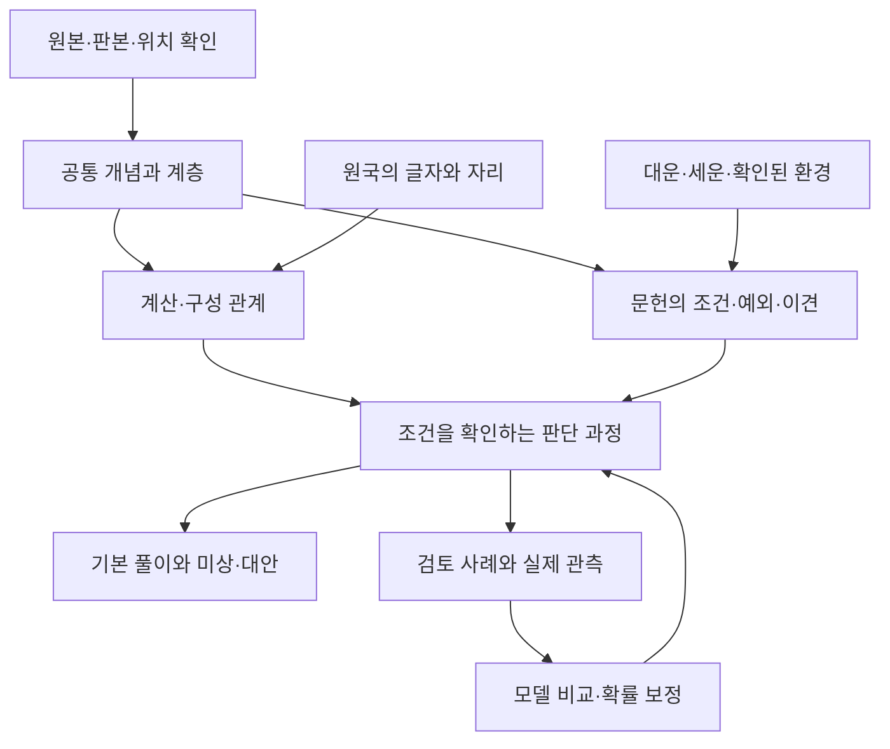

# 사주 기초 보강 청사진 v1

2026-09-23 · 실제 폴더 확인에 근거한 실행 계획
**상태: 저장소 인계용 청사진. 원본·실행 사전·앱 계산의 통합은 아직 하지 않았다.**

시작과 현재 작업 순서는 [FOUNDATION_HANDOFF.md](FOUNDATION_HANDOFF.md), 17개 문서 대조는 [FOUNDATION_AUDIT.md](FOUNDATION_AUDIT.md)를 따른다. 아래 수치는 2026-09-23 점검 스냅샷이며 재생성 후에는 새 측정값과 구분한다.

## 먼저 할 일

**로컬 폴더와 GitHub에 나뉜 기초 작업을 대조한 뒤, 개념·자리·관계·조건을 하나의 기준으로 연결한다. 그 위에 판단 과정과 기본 풀이를 쌓는다.**

목표는 단어 설명을 늘리는 것이 아니다. 같은 글자도 자리, 주변 글자, 합충, 세력, 대운·세운, 확인된 환경에 따라 다른 판단으로 이어지는 구조를 만드는 것이다. 관계를 많이 그린 것과 해석이 정확해진 것을 따로 평가한다.

이 문서는 최신 요청인 “기초 보강”과 “청사진”에 맞춘 제안이다. 옛 문서의 역할 지시·작업 명령은 과거 기록으로 읽었고 자동 실행하지 않았다. 기존 큰 목표인 조건부 확률 지식망을 유지하면서, 이번 우선순위를 기초 정합성으로 앞당긴다.

## 1. 폴더 접근과 확인 범위

공개 저장소에서는 개인 계정·기관 경로를 생략하고 원본 루트를 다음 별칭으로 부른다. 이 별칭은 설정값이나 실행 명령이 아니다:

```text
<SAJU_SOURCE_ROOT>
```

- 폴더 목록과 실제 Markdown 본문, 정제 데이터, 사전 코드를 백그라운드에서 읽었다.
- Remote Desktop Commander 연결 도구는 연결된 기기가 없다고 응답했다. 현재 컴퓨터에서는 Codex의 로컬 파일 접근과 Desktop Commander 파일 읽기로 접근에 성공했다. 원격 화면 조작은 사용하지 않았다.
- 이번 확인은 자료 폴더 중심이다. 인증 자료의 내용을 열거나 외부로 올리지 않았다.
- 원본 전체를 전수 정독했다는 뜻은 아니다. 아래 건수는 파일·레코드 수이며 내용 품질 검사와 구별한다.

## 2. 출발점: 작업이 양쪽으로 나뉘어 있다

| 항목 | 로컬 폴더 직접 확인 | GitHub 작업본 확인 |
|---|---:|---:|
| 첨부 설계정본 | 17개 | 17개 보존 |
| P0 글 / 문단 | 3,845 / 38,072 | 3,881 / 38,367 |
| P0 배치 | 90개 | 91개 |
| 사전 코드의 개념 | 264개 | 271개 |
| 생성된 정의카드 | 262개 | 271개 |
| 생성된 관계 목록 | 6,785개 | 7,295개 |
| 판단 과정 시범 자료 | 판단 6 + 역추론 6 | 판단 6 + 역추론 6. 내용은 로컬과 다름 |
| 옵시디언 파일 | 개념 262 + 중주제 52 + 대주제 15 + 시작 안내 4 | 기존 지도 및 별도 연구 그래프 존재 |
| 새 연구 모델 | 이 비교의 로컬 대상 아님 | 기본 개념 18, 전체 항목 58, 관계 132 |

**확인한 차이:**

- 로컬에만 있는 사전 항목: **합(총칭), 충(총칭)**.
- GitHub에만 있는 사전 항목: **12시진, 계절, 운(총칭), 자전축(23.5°), 지구 공전, 지구 자전, 태(態), 행성 배속, 황도(태양황경)**.
- 로컬에는 통근의 ‘뿌리가/뿌리를’, 조후의 ‘춥습니다/덥습니다’, 배우자의 ‘부부간/부부관계’ 같은 구어 별칭 보강이 있다.
- GitHub에는 여러 한자 별칭과 일부 전사 표기 보강이 있다.
- 양쪽 판단 과정 12개는 같은 이름만 가진 완전 동일본이 아니다. 링크, 일부 근거와 검증 정보가 다르다.
- 로컬 사전 코드 264개와 생성된 정의카드·볼트 262개도 수가 다르다. 생성 시점·생성 대상 정책을 확인해야 하며, 개수 차이만으로 데이터 유실이라고 단정하지 않는다.

두 사전의 **현재 이름만 합치면 273개**다. 이것은 검토 대상 이름의 합집합일 뿐, 반드시 273개 노드를 만들어야 한다는 목표가 아니다. 어느 한쪽을 통째로 최신본으로 덮어쓰면 안 된다.

### 별도로 보존된 원료

| 실제 확인한 자산 | 규모 | 쓰임 |
|---|---:|---|
| 원본 라이브러리 웹 스크랩 | DOCX 76개 | 기초 정의·관계·조건·예외 대조 |
| 원본 라이브러리 전사 본문 | 6개 채널 폴더의 MD 2,161개 | 구어 표현·풀이 과정·반례 보강 |
| 전사 수집 명세 | MD 7개 | 수집·보류·누락의 경위 확인 |
| 로컬 별도 전사 적재 파일 | 글 레코드 4,494 / 문단 레코드 37,529 | 적재 단계 확인 대상. 위 원본·P0와 중복 여부 대조 필요 |
| 기존 앱 내용 모음 | MD 26개 | 기존 방법론·발췌의 출처 복구 |
| 로컬 앱용 지식 파일 | 앱두뇌.json 약 3.49MB | 재사용 구조 검토. 존재만으로 앱 연결·정확도가 입증되지는 않음 |

**이 숫자들을 모두 더해 고유 자료 수로 세지 않는다.** 원본·수집 사본·문단 정제·앱용 변환본이 섞여 있다.

## 3. ‘기초’의 범위

아래는 작업 순서이며, 노드를 한 줄짜리 서열로 고정하겠다는 뜻은 아니다. 하나의 개념은 여러 관계와 연결될 수 있다.

| 묶음 | 다룰 것 | 보강 결과 |
|---|---|---|
| ① 기호와 기본 관계 | 음양, 오행, 천간 10, 지지 12, 생극 | 같은 이름·다른 글자를 구별하고 계산 가능한 관계를 명시 |
| ② 원국의 자리 | 연월일시, 일간·일지·월지, 지장간, 궁위, 근묘화실, 인접·거리 | 글자가 어디에 놓였는지 별도 입력으로 보존 |
| ③ 기준에 따른 이름 | 십성·육친, 일간 기준, 천간/지장간 관계 | 십성을 성격의 고정 꼬리표로 쓰지 않고 관계에서 산출 |
| ④ 글자끼리의 만남 | 합·충 총칭과 하위 종류, 형·파·해, 합화, 쟁합·쟁충 | 관계의 참여자·자리·조건·예외를 구분 |
| ⑤ 세력과 판단 기준 | 통근·투출, 월령, 강약, 조후, 격국·용신 | 판본에 따른 계산 차이와 해석 차이를 분리 |
| ⑥ 시간 | 출생 시각 보정, 자시 분기, 원국·대운·세운·월운 | 태어난 구조와 특정 시기에 들어온 조건을 구분 |
| ⑦ 보조 체계·관법 | 십이운성·신살, 적용 기준, 저자별 이견 | 사용 조건·다른 판본·확인하지 못한 부분을 보존 |
| ⑧ 해석으로 가는 과정 | 일주·성향·관계·직업 등 풀이 대상, 질문·응답·예외 | 결론 문장을 고정 저장하지 않고 판단 경로를 추적 |

기초의 구분 기준과 개인에 대한 해석을 혼동하지 않는다. 예를 들어 서로 다른 한자 ‘신금(辛)’과 ‘신금(申)’은 구별해야 한다. 반면 한 용어만 보고 개인의 성향이나 사건을 확정하는 문장은 기초 정의로 승격하지 않는다.

## 4. 만들 구조



### 개념마다 남길 정보

- 고유한 이름과 식별자, 별칭, 다른 뜻으로 쓰인 경우.
- 어느 분류에 속하고 어떤 계산·관계에서 사용되는지.
- 필요한 입력과 기준점. 예: 일간 기준인지, 연지 기준인지.
- 연결된 개념·관계·조건·이견.
- 원문과 수정 이력으로 돌아갈 내부 기록.

### 관계마다 남길 정보

- 관계 종류: 분류, 구성, 계산, 조건부 주장, 예외, 반론 등.
- 참여 개념 전체, 방향, 자리, 적용 시간.
- 어떤 조건에서 성립하고 어떤 조건에서 약해지거나 바뀌는지.
- 필요한 값 중 확인된 것·미상·명시적으로 없는 것.
- 어떤 문헌·판본에서 나온 관계인지와 검토 상태.
- 수치가 있다면 그 수치의 뜻. 계산 정책·자료의 지지 정도·학습된 확률을 분리.

**단어 두 개의 선 하나에 모든 뜻과 확률을 몰아넣지 않는다.** 여러 조건이 함께 필요한 관계는 그 조건 묶음을 유지한다. 기존 그림의 거리·선 굵기·노드 크기가 문단 수인지 관계 종류인지 영향도인지 표시하고, 그림 배치를 추론값으로 사용하지 않는다.

### 출처와 사용자 화면

과거 원문에는 “정의마다 저자와 인용을 붙이지 말라”는 요청이 있고, 현재 저장소에는 근거 추적 요구가 있다. 청사진에서는 **내부 검수 기록**과 **사용자에게 보이는 풀이**를 구분하는 방식을 제안한다. 내부에서는 자료 계보와 위치를 보존하고, 풀이 화면의 출처 표시 방식은 별도로 다룬다. 두 요청을 같은 뜻이었다고 소급해서 고치지 않는다.

## 5. 실행 순서와 통과 기준

현재 우선 범위는 **0~3단계의 기초 보강**이다. 4~6단계는 그 결과를 활용하는 후속 계획이다.

| 단계 | 실제 작업 | 산출물 | 다음으로 넘어가는 기준 |
|---|---|---|---|
| **0. 자산·판본 대조** | 로컬/저장소/생성본 대응, 원본 ID·해시·중복 확인, 서로 다른 수정 이력 보존 | 파일 대응표, 차이 목록, 재생성 경로 | 이번 보강에 쓰는 파일은 출처·판본·생성 방법을 확인할 수 있고, 미확인은 따로 표시됨 |
| **1. 공통 개념 정리** | 양쪽 사전 273개 이름 후보 검토, 별칭·동명이의어·총칭/하위 개념 정리, 공백 31개 권고 재검수 | 공통 개념표, 별칭표, 보류·분리·채택 기록 | 대상 항목마다 처리 상태와 이유가 있고, 승인된 이름을 쓰는 링크의 깨진 참조가 없음 |
| **2. 기초 관계·계산 대조** | 기본 관계와 자리/시간 입력 정의, 강약·자시 등 판본 차이 정리 | 관계표, 계산 정책표, 서로 다른 결과의 비교표 | 같은 입력·같은 판본은 재현되고, 판본이 다르면 무엇이 달라졌는지 설명 가능 |
| **3. 조건·판단 과정 보강** | 기존 조건 후보 767개를 분류하고, 첫 대상 관계부터 조건·예외 검토. 판단 과정 12개 양쪽 판본 재검수 | 검토된 조건 묶음, 판단 단계, 미상 처리, 예외 기록 | 첫 대상의 각 단계가 근거 또는 명시된 계산으로 연결되고, 조건·인용 검사 실패를 우회하지 않음 |
| **4. 기본 풀이 검증** | 기존 60일주·성향 초안을 검토된 구조에 연결. 작은 대표 묶음부터 검증 후 확대 | 입력→판단→문장→근거 연결표 | 문장별 적용 범위가 있고 생시 미상·반대 조건·저자 이견이 출력에 남음 |
| **5. 시간·환경 확장** | 같은 원국의 다른 시점과 조합을 비교. 필요한 실제 환경은 확인된 것만 입력 | 시점 비교 사례, 추가 질문과 응답 기록 | 어느 추가 조건 때문에 판단이 달라졌는지 재현 가능하고 미래 정보가 과거 입력에 섞이지 않음 |
| **6. 학습·평가** | 결과의 뜻과 관측 기준 확정, 자료 중복·인물·시점 분리, 같은 자료에서 모델 비교 | 별도 평가 자료, 비교 결과, 확률 보정 기록 | 추가 변수의 효과를 측정해 보고하고 미학습 숫자를 실제 확률로 제시하지 않음 |

0단계의 폴더 접근·선택 파일 차이 확인은 이번에 수행했다. **전체 판본 통합이나 1~6단계 구현은 아직 수행하지 않았다.** 문서 분석 자료가 있다는 것과 기능이 작동한다는 것은 별도 상태로 남긴다.

## 6. 첫 보강 묶음

| 순서 | 대상 | 구체적으로 할 일 | 완료 결과 |
|---|---|---|---|
| A | 두 사전의 차이 | 로컬 전용 총칭 2개, 저장소 전용 9개, 양쪽 별칭 차이에 적용 근거와 조건을 붙임 | 차이를 잃지 않은 검토표. 합치거나 보류한 이유 기록 |
| B | 놓친 구어 표현 | 통근·조후·상극·배우자 표현을 문맥으로 구별. ‘뿌리’, ‘추위’ 단어만으로 자동 분류하지 않음 | 실제 명리 문맥과 일상 문맥을 함께 검사한 별칭 |
| C | 사전 공백 31개 | 등재·보류·기각 권고를 현재 원문/사전과 다시 대조. 편인도식·상관패인·재생관·관살혼잡·사길신·사흉신부터 확인 | 여섯 용어의 자리를 정하고 조건 관계가 필요한 항목은 관계로 연결 |
| D | 자리와 시간 | 일간·일지·월지·통근·투출·궁위·근묘화실·인접/거리, 원국/운의 역할 분리 | 각 관계가 어떤 자리와 시점에 작용하는지 기록 |
| E | 계산 차이 | 강약의 연지/시지 배점, 자시 처리의 설계/앱 차이를 각각 비교 | 판본별 값·출처·현재 앱 사용값·영향을 한 표로 확인 |
| F | 판단 과정 12개 | 로컬과 저장소의 링크·근거 차이를 대조하고 인용 검사 재실행 | 살아남은 단계와 보류 단계가 명시된 일관된 시범 묶음 |

A~F는 이 청사진의 추천 순서다. 새 규칙을 임의로 만들어 빈칸을 채우지 않는다. 기준이 갈리는 E는 먼저 비교 결과를 완성하고, 현재 지시·정본으로 선택이 풀리지 않는 항목만 사용자 판단 대상으로 남긴다.

## 7. 자료를 사용하는 순서

| 자료 | 우선 쓰임 | 하지 않을 해석 |
|---|---|---|
| 최신 사용자 요청·기존 발언 원문 | 목표, 금지된 단순화, 우선순위 | 예시를 정답 규칙으로 채택 |
| Figma 보드·기존 방법론 | 기초 범위·구성·계산표 대조의 출발점 | 모든 해석이 검증된 사실이라고 간주 |
| 웹 스크랩 | 비교적 정돈된 개념·조건·예외 | 반복 글 수를 독립 증거 수로 계산 |
| 전사 원문 | 구어 표현·판단 순서·변경 조건 | 음성 인식 결과나 gist를 무검수 근거로 승격 |
| 기존 P0·사전·관계망·앱두뇌 | 이미 한 작업을 재사용하는 출발점 | 저장돼 있다는 이유로 승인·정확성 확정 |
| 기존 앱 코드 | 실제 계산·출력 경로 확인 | 실행된다는 이유로 문헌·계산 정책의 정당성 확정 |
| 옵시디언·지식망 화면 | 연결을 탐색하고 빈틈을 확인 | 화면상의 가까움이나 선 개수를 현실 확률로 해석 |

신규 자료는 **같은 자료 / 다른 판본 / 추가 근거 / 반대 근거 / 새로운 관계**로 먼저 나눈다. 같은 저자의 블로그와 영상, 재인용, 수집 사본을 서로 독립된 여러 근거로 세지 않는다.

## 8. 잘 보강됐는지 보는 기준

완료율 하나로 합치지 않고 다음을 각각 센다. 통과 기준은 채택된 작업 범위 안에서 적용한다.

- **자료 연결:** 원문·판본·구간까지 돌아갈 수 있는 비율.
- **이름 정리:** 검토 완료, 보류, 중복, 다른 뜻으로 분리한 항목 수.
- **관계 품질:** 관계 종류·조건·예외·자리·시간이 기록된 비율.
- **판단 과정:** 근거 없이 건너뛴 단계, 반대 조건을 누락한 단계 수.
- **계산 일치:** 같은 판본에서의 재현성, 명시되지 않은 판본 혼합 수.
- **풀이 일치:** 출력 문장이 사용한 입력·조건·근거와 맞는지.
- **평가 성능:** 문헌 재현과 실제 결과 예측을 각각 측정. 자료가 준비되기 전에는 미측정으로 둠.

현재 확인된 ‘271개 중 51개 대응’은 이름 연결의 상태다. 전체 기초 완성률이나 해석 정확도 18.8%라는 뜻이 아니다.

## 9. 첫 번째로 보여줄 결과

기초 보강 첫 묶음이 끝나면 다음을 함께 보여준다.

1. 로컬과 GitHub의 차이 중 무엇을 채택·통합·보류했는지.
2. 개념을 누르면 상위 분류, 연결 관계, 조건·예외·판본을 볼 수 있는 표 또는 기존 지도.
3. 첫 대상 입력에서 판단 단계가 어떻게 이어지고 어디서 보류되는지.
4. 관계·문장·계산의 실제 전후 차이와 검증 결과.

기존 옵시디언과 지식망은 검토 화면으로 활용한다. 앱 계산·풀이의 새 기준이 준비되면 같은 정제 자료에서 화면과 실행 데이터를 생성하는 방향으로 맞춘다. 매번 화면용 사전과 앱용 사전을 따로 고쳐 둘이 어긋나는 일을 줄이는 것이 목적이다. 구체적인 저장 형식·생성기는 0단계의 경로 대조 후 확정한다.

**추천하는 한 수:** 파일별 “완료” 표시 대신 **개념별 반영표**를 둔다. 예를 들어 ‘통근’ 한 행에서 원문 → 구어 별칭 → 자리 조건 → 판단 단계 → 앱 사용 여부를 모두 확인한다. 지금 확인된 ‘자료에는 있으나 다음 단계에 빠진 부분’을 찾는 데 효과가 클 것으로 판단한다. 판단 확신도 95%이며 측정한 성능 수치는 아니다.

## 10. 근거와 미확인 범위

### 이번에 직접 확인한 로컬 자료

위 지정 경로를 기준으로 한 상대 경로다.

- [L1] `★운영자원문_260726_전량.md`: 01~28 전체. 관계·다중 조건·정성 자료의 정량화에 관한 사용자 원문.
- [L2] `★이어받기.md`: 앞부분의 자료 구조·과거 상태. 수치를 최신값으로 채택하지 않음.
- [L3] `2. 정제작업/_인수인계/0804-1006_인수인계본_v07.md`: 구어 별칭·인용 검사·12개 판단 과정의 수정 이력 및 미완료 항목.
- [L4] `2. 정제작업/_현황판/build_concept_map.py`와 저장소 대응 파일: 사전 구조를 코드 실행 없이 읽어 항목·별칭 대조.
- [L5] `2. 정제작업/_현황판/data/`: 정의카드·링크망·조건부 관계·P0 합본·별도 전사 파일·앱두뇌 파일 확인.
- [L6] `2. 정제작업/P2_유닛/pilot_UJ.jsonl`, `pilot_UI.jsonl`: 저장소 대응 파일과 레코드 대조.
- [L7] `7. 옵시디언 볼트/`: Markdown 파일 수와 `00 시작/📖 기초부터 읽는 순서.md` 앞 95줄 확인.
- [L8] `1. 원본 라이브러리/`, `6. 사주 앱에 기존에 담겼던 내용/`: 폴더별 파일 목록·확장자 집계.

### 저장소 근거

점검 기준 main: `05a5eab0122eda37235feb66114c6c3d8249a705`.

- [사용자 의도 기록](https://github.com/muteno/Saju/blob/05a5eab0122eda37235feb66114c6c3d8249a705/docs/knowledge-model/USER_INTENT_LOG.md)
- [프로젝트 아젠다](https://github.com/muteno/Saju/blob/05a5eab0122eda37235feb66114c6c3d8249a705/docs/knowledge-model/PROJECT_AGENDA.md)
- [현재 범위](https://github.com/muteno/Saju/blob/05a5eab0122eda37235feb66114c6c3d8249a705/docs/knowledge-model/CURRENT_STATE.md)
- [기본 풀이 계획](https://github.com/muteno/Saju/blob/05a5eab0122eda37235feb66114c6c3d8249a705/docs/knowledge-model/BASIC_READING_PLAN.md)
- [기존 자료 이관](https://github.com/muteno/Saju/blob/05a5eab0122eda37235feb66114c6c3d8249a705/docs/knowledge-model/LEGACY_MIGRATION.md)

### 아직 확인하지 않은 것

- 로컬 전사와 저장소 전사의 전체 고유 영상·본문 중복 여부.
- 로컬 산출물 전체의 재생성 및 모든 검사 통과 여부.
- 양쪽 사전 차이의 모든 항목에 대한 의미 검수.
- 새 기초를 반영한 실제 앱 계산·화면·해석 정확도.
- 실제 관측 자료로 학습하거나 보정한 확률.

이번 결과물은 **무엇을 어떤 순서와 기준으로 보강할지 정한 청사진**이다. 문서의 저장소 편입을 기초 통합 구현·앱 적용·학습 완료로 보고하지 않는다.


## 기존 설계와 연결

- [정제틀 v2](../../정제/문서/설계정본/20260721_170000_정제틀_설계_v2.md): 자료·유닛·질문 층의 기존 구분을 계승한다.
- [경로 중심 P2 v3](../../정제/문서/설계정본/20260725_1300_P2_유닛스키마_v3_경로중심.md): 조건→단계→근거·반전의 구조와 앞선 초안 정정을 함께 본다.
- [기존 원리 정제 청사진](../../정제/문서/설계정본/20260728_0500_원리정제_청사진_v1.md): 선 개수보다 이유와 다른 경로를 보강한다는 취지를 계승한다. 당시 수치·에이전트 편성·작업 명령은 과거 기록이다.
- [기존 이관](LEGACY_MIGRATION.md)·[기본 풀이](BASIC_READING_PLAN.md)·[수학 모델](MATHEMATICAL_DESIGN.md)·[학습과 평가](학습과평가설계.md): 폐기하지 않고 기초 보강 뒤에 이어지는 실행 경로다.
- [검토용 차이 자료](data/foundation_review_bundle.json): 양쪽 사전의 항목·별칭, 기존 P2 12개에서 달라진 필드의 양쪽 값을 보존한다. 자동 적용·학습 입력이 아니다.
