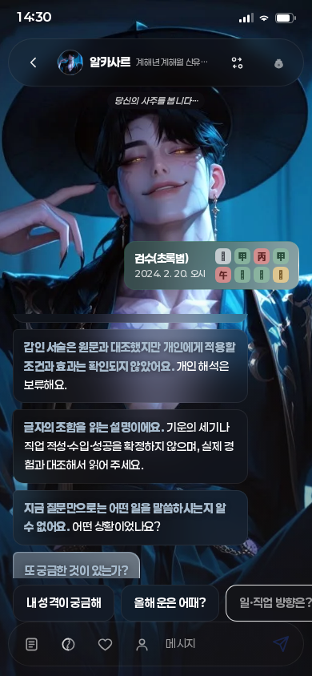
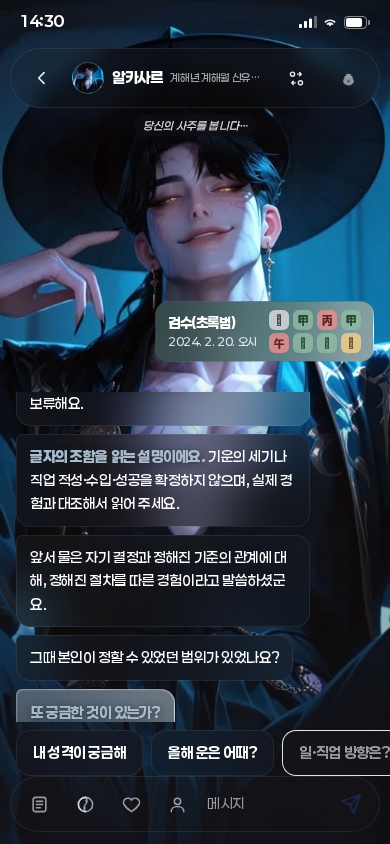

# 실제 질문·답변을 다음 상담에 연결

2026-09-29 · 사용자 원문76 · 기준 PR217 `d0d4c8e6d228541b6c3db11f9c53daf1c9ad4892`

**상시 목표: 생년월일시로 얼마나 깊이 사주를 풀 수 있는지, 정확도를 어디까지 확인했는지에 집중한다. 개인 적중률은 미측정이다.**

## 실제 개선과 범위

이전에는 화면에 앞 대화가 남아 있어도 자유입력·원국요약·근거 자료를 보내고 이전 대화는 보내지 않았다. 이제 같은 프로필·화자·주제에서 실제로 표시된 최근 질문과 사용자 답을 다음 자유입력에 함께 보낸다. ‘그때는 없었어요’처럼 앞 질문이 필요한 말을 다음 설명·추가 질문에 연결할 입력이 생겼다.

`DosaChat` → `dosaClient` → `functions/api/dosa.ts` → 기존 공급자 요청 경로에 `conversation`을 추가했다. 정답·성격·학습 라벨·정확도 필드는 없고 메시지 원문과 화자 역할, 주제만 보낸다. 긍정·반대·경험 없음·미응답은 단어 몇 개로 자동 분류하지 않으며, 모델이 원문에서 구별하고 어느 질문에 대한 답인지 불명확하면 확인하도록 지시한다. 원국요약의 경험 질문은 후보이며, 실제 질문 여부는 표시된 대화로만 판단하게 했다.

이 변경은 **대화 맥락 전달의 구현**이다. 실제 공급자가 매번 경험을 정확히 해석하거나 반복 질문을 하지 않는다는 실측 검증은 아니다. 원국의 강약·통근·합충·대운을 종합한 개인 판단이나 사주 적중률이 새로 확인된 것도 아니다.

## 상태와 전송 경계

- 최근12말풍선, 메시지당2000자, 총8000자 이내. 마지막부터 연속된 완전한 메시지를 고른다. 길이를 넘는 문장의 일부를 잘라 부정/조건을 바꾸지 않는다.
- 아직 큐에 있는 말과 타이핑 중인 마지막 말, 지문·전송실패 안내는 제외한다. 현재 사용자 입력은 `question`에 한 번만 포함한다.
- 이전 사용자 답과 읽은 생성 답변/추가 질문을 다음 요청에 보낸다. 생성 답은 대화 기록이며 검증된 명리 근거로 승격하지 않는다. 검토 보류된 assistant 문구가 분할돼 재등장해도 해당 대화 맥락을 사용하지 않는다.
- 재시도는 첫 요청의 맥락 snapshot을 재사용하고 사용자 말풍선을 복제하지 않는다.
- 프로필·화자·주제 전환은 새 전달 맥락. 자동 정곡 부정 교체 시 방금 예약한 이전 답변도 제외한다. 수동 교체에 같은 +1을 적용하지 않는다. 프로필·화자 전환 시 미전송 초안도 비운다.
- 요청취소·오래된 응답은 기존 revision과 AbortController로 차단한다. 생시미상 요청0 유지. 프리페치에는 대화가 없고 서버도 자유입력 없는 대화 payload를 거절한다.
- 새 외부 저장·localStorage·학습 저장·추가 공급자 호출을 만들지 않았다. 화면 이탈/새 세션/프로필 교체 시 기록을 이어 읽는 영구기억은 아니다.

서버는 시스템 역할, 잘못된 버전/형식/주제, 개수·길이 초과를 호출 전400으로 거절한다. 허용 필드만 복사한 JSON을 참고 대화 구역에 넣고, 시스템 지시·명리 근거 구역과 구분한다. 이는 형식/프롬프트 경계이며 실제 모델의 지시 주입 저항을 인증하는 시험은 아니다.

## 검증과 실패 교정

- 기준 main의 필수8게이트·앱22검사·실제 Chromium 통과 뒤 독립 작업트리에서 수정했다. 기존 작업 폴더의 Git 연결이 사라져 최신 원격을 재복제했고 기준 PR/tree를 재독했다.
- 신규 현재9검사: 원문4응답 유형/복사·완전문장 상한, API 비정상13+주제요청 거부, client 미상/취소/프리페치, 서버 문맥/역할 분리, 현재110합성 입력·510요청·미상8 전체출력/계산 보존, 현재 생성답변의 안내/질문1회, 보류 assistant 분할 방어. 9/9·skip0.
- 110행 비교의 첫 테스트는 상위 TypeScript import hook이 Vite CJS의 상대 require를 file URL로 바꿔 `picomatch` 해소에 실패했다. 같은 비교/assert를 `check_conversation_consumers.mjs` 독립 프로세스로 실행해 정상9/9를 확인했다. 기대값·과거 소스해시는 바꾸지 않았다.
- 최종 문서의 기존 요청 설명을 교정하며 검사를 재시작하는 과정에서 두 커밋훅 실행이 잠시 겹쳤다. 둘 다 명시적으로 중단(exit130)했고 이를 통과로 세지 않는다. 문서·소스 확정 뒤 단일 활성 훅으로 전체8게이트를 다시 실행한다.
- 단일 전체 검사에서 과거 PR215 전달검사 한 건이 현재 API를 상속해 소스해시가 달라 실패했다(앱30/31). PR215/216의 작은 fixture에 당시 미변경 API가 없던 원인이었다. PR217 fixture의 동일한 과거 API만 먼저 고정하고 각 판본의 원래 overlay를 적용하도록 재현기를 고쳤다. 과거 manifest·기대해시는 유지했으며 영향받은 전달검사8/8·skip0을 재확인했다. 최종 전체검사·원격확인 결과는 PR 본문의 단일 영수증으로 남긴다.
- PR217 원래7검사와 측정은 `frozen_conversation_context.mjs`로 별도 재현한다. 기준 commit의8소스를 원본 바이트/LF해시로 확인했다. 현재 검사도 별도로 유지하며 과거 검사를 현재 정확도 검사로 대체하지 않는다.
- 실제 Chromium7시나리오: 390/1280px의 표시질문/큐 제외·다음 답/질문·retry·주제전환, 자동 화자교체, 수동 화자/프로필 취소·지연응답, 미상 요청0, 부분 타이핑 제외. 페이지오류/가로넘침0. [시나리오 결과](evidence/conversation-context/browser-results.json).
- 처음 만든 전후 캡처는 입력 포커스 때문에 ‘다음’ 버튼이 감춰져 보류 안내까지만 찍었다. 포커스를 해제하고 모의 후속 설명·질문까지 실제로 읽은 뒤 전후 DOM/PNG를 다시 기록했다. 모의 대사의 내용은 품질 측정이 아니라 전달에 따른 동작을 보여주는 예시다.
- 독립 서버 검토는 기존 무맥락15요청 동일, 경계7사례, 보류문장32사례 총54통과를 확인했다. 실제KB 최대 요청에 최대 대화/질문을 더한 읽기 점검은31,844B로 서버64KiB 안이었다.

최종 활성 커밋훅의8게이트, 최신 원격 head 검사·병합/main/tree의 실제 영수증은 PR 본문에 한 번 남긴다. 아래 화면과 모의 시험을 실제 공급자 정확도 인증으로 읽지 않는다.

| 변경 전 | 변경 후 |
|---|---|
|  |  |

## 독립8관점 검토

같은 모델 최고 노력8관점. 실행 한도는 루트 포함7이라6+2로 수행했으며8명 동시는 아니다. 저장소 읽기 전용 검토와 /tmp 실측으로 확인한 지적만 반영했다.

| 관점 | 직접 확인·반영 결과 |
|---|---|
| 1 대화 범위 | 자동 정곡 부정 시 이전 답만 새 화자에 넘어가는 오류 재현. 해당 경계만+1로 교정 |
| 2 서버 API |54모의사례/기존 무맥락동일·상한·보류문장 방어 통과. 실제모델 의미준수는 미검증 |
| 3 제품 의미 | 실제 질문/사용자답 payload 확인. 초기 캡처가 안내까지만 보인 한계 교정, 경험해석 정확도 과장 금지 |
| 4 검사 적대 | 복사보호 assert가 새 객체를 검사하던 오류를 돌연변이로 확인. 같은 원본 객체를 재사용하도록 교정 |
| 5 과거 재현 |8fixture 원본바이트/해시 및 원래7검사/110측정 확인. 현재110행과 생성답변 검사도 별도 추가 |
| 6 실제 화면 |표시/큐/부분타이핑·retry·전환취소/지연응답 직접 검증. 추가 차단0 |
| 7 수정본 범위 |자동 고아답 제외, 자동/수동/프로필 초안삭제, 표시/부분/재시도·stale3경로 독립 재확인 |
| 8 수정본 계약 |9검사/8fixture/현재110행 비교·요청최대크기 확인, 7관점 반론 공유. 잔여 차단0 |

## 다음 실제 풀이 개선

[인계 §5.1](FOUNDATION_HANDOFF.md): 기존 월·시 조합 설명에 원국의 확인된 추가 조건 한 가지를 연결한다. 강약·통근·합충 중 적용 가능성이 확인된 좁은 조건을 골라 같은 일주·다른 월/시의 최종 풀이가 어떻게 달라지는지 검증한다. 잠정 점수·글자 수·조건 적합을 개인 능력이나 확률로 바꾸지 않는다.

현재15해석/25순서쌍의 역순 본문 동일, 전체60일주 깊은 종합풀이, 시간별 개인효과와 학습/평가는 남는다. 개인 적중률 미측정·학습적격0·확률null·관리9/20 유지. 자료량·합성입력·테스트 통과율은 개인 정확도가 아니다.
