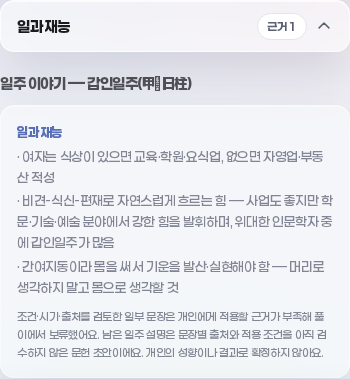
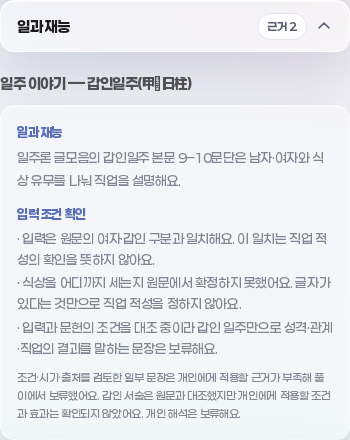

# 갑인 검토판 — 입력조건과 개인 전달 계약

2026-09-28 · 사용자 원문68 · 기준 PR #212/main `70b1a9c0a118b6681fe0372499197fc2e424a468`.

갑인 검토35서술을 갑인 블록의 개인 출력에서 보류하고, 직업 문헌 GI09/10의 입력 범위·확정할 수 없는 조건·출처를 실제 리포트에 연결한다. 입력 성별과 일주가 문헌 범위에 맞는 것은 직업 적성이나 개인 효과의 확인이 아니다. **개인 승인0·학습 적격0·확률null·관리9/20=45% 유지**다.

## 1. 원문과 전달 범위

[기존 검토판](data/gapin_sentence_review.json)의 35서술+제외메모1, [기존14항목](data/basic_sentence_review.json), KB 원문·감사·측정 파일은 변경하지 않았다. 새 생성기 `build_gapin_sentence_policy.py`는 원문/검토판의 정본 검증 후 별도 `gapinSentenceData.js`로 투영한다.

| 대상 | 처리 |
|---|---|
| 갑인35서술 | 핵심·성격·직업·관계·주의·물상·인용·견해·기타의 알려진 문구 보류. 원문 위치·조건·예외·시기·계보·구판 재사용 ID 보존 |
| 알려진 주장31문구 | 다른 블록의 동일 문구, NFC/공백 변형, 복제·분할된 상담 근거, 생성응답·Brain에도 기존 공통 경계 적용 |
| GI30/31/32/35 | 일반적인 서술 방법분류와 참고문헌. 다른 일주도 공유하므로 **갑인 블록 안에서만** 보류. 전역 개인주장 필터로 사용하지 않음 |
| GI36 제외메모 | 문장으로 집계·차단하지 않음. 2020년 문맥 누락은 원래 GI01/18 검토에 보존 |
| 견해그룹 | 한쪽과 일치하면 해당 그룹 ID/문맥 전체를 보류. 다른 조건을 합의·모순으로 단순화하지 않음 |
| 구판 v1 리포트 | 이미 삭제된 문구의 유효 기존 ID를 보존하고 현 정본에서 메타데이터 재구성. v1에 임의 GI ID를 넣어 승격할 수 없음 |

35와 기존14의 합49는 정책 레코드 수다. 중복/재사용을 제거한 독립 주장·출처 수가 아니다. 알려진 문구 검사는 모든 의역을 판별하는 의미 분류기가 아니다. 일반 메타4개가 서버 전역 필터에 남지 않는 것은 의도한 범위 제한이다.

## 2. 입력→조건→설명→근거

`report.js`가 실제 차트를 `evaluateGapinConditions`에 전달한다. 앱의 양력/시각 계산 정책은 그대로이며 새 문헌 판정이 만세력 정책을 바꾸지 않는다.

| 항목 | 판정/근거 |
|---|---|
| 갑인 일주 | 기존 계산 결과의 일주 인덱스50과 대조. 충족/불충족/미상 |
| 원문 남자·여자 범위 | 기존 입력값 M/F와 대조. 원문 성별 구분에 대응하는 구현값이며 개인 성향 추론 아님 |
| 식상 있음/없음 | 표면·본기·전체 지장간 범위가 원문에서 확정되지 않아 두 갈래 모두 unknown |
| 금 관성이 튼튼함 | GI09 남자 문단의 별도 직장 대안. 강도 기준 unknown. 사업의 필수조건이나 여성 규칙으로 옮기지 않음 |
| 글자 관찰 | 기존 tables의 천간(일간 제외)+본기, 천간+전체 지장간을 각각 위치와 함께 기록. 문헌의 식상 조건을 대신하지 않음 |
| 시간 미상/잘못된 시간 | 관찰null·일주 범위unknown. 이미 알려진 성별의 범위 불일치는 남을 수 있지만 개인적용은 항상 보류 |
| 문헌 조건 전체 | 대상 일주/성별이 다르면 unmet, 맞거나 부족하면 unknown. 이번 범위에 전체조건 met인 개인 해석은 없음 |

일주론 글모음 본문9–10/XML257–258을 GI09/10의 정확한 문단으로 연결한다. 넓은 검토구간9–12와 앞뒤 예외는 함께 보존한다. 같은 글49·55/XML297·303은 寅 지장간 丙을 식신이라고 쓴다. 전체 지장간 관찰을 조건으로 사용하면 갑인의 ‘식상 없음’ 갈래가 사라지므로 실행식으로 확정하지 않았다.

같은 갑인 날짜에 남녀·시각을 바꾸면 범위 판정과 글자 관찰은 달라진다. 화면에는 대상 범위 일치와 보류 이유만 설명한다. 직업 적성·결혼·건강·성취 결과를 새로 승인하지 않는다. 원문의 시대/성별별 주장을 앱의 가치판단이나 경험적 사실로 채택하지 않는다.

## 3. 실제 소비와 이전 판본

새 [측정](data/gapin_delivery.json)은 실제KB/Brain·원래 앱 함수·고정시계의110합성입력(알려진102·미상8), 모의상담510요청이다. 사용자 표본이나 개인 정확도 통계가 아니다. 현재 코퍼스에서는 갑인1행이며 남녀·시각·잘못된값의 경계는 별도 검사다. 실제 개인 출력에 있던 새19개 ID는 변경 후0이며 다른일주109행(미상8 포함)의 reading/topics/requests/Brain을 보존한다.

카드·리포트Markdown·상담 근거·client/server 응답·Brain에 알려진 주장 잔존 여부를 검사한다. 미상8행은 전체동일/요청0, 차트·강약·조회키·일진·정곡·공유입력과 현침 계약을 유지한다. 갑인 외 읽기/주제/실제요청/Brain의 전후동일도 검사한다. 외부 LLM은 호출하지 않았다.

[고정판15소스](fixtures/gapin-delivery-v1/manifest.json)는 기준main Git blob·LF SHA256을 보존한다. `frozen_gapin_delivery.mjs`에서 구판14정책의12검사 및 이전 제품 진단을 재현한다. 현재 코드를 맞추려고 과거 해시를 덮지 않는다. 새9검사는 필수 앱 게이트에 연결했고 과거12검사의 실제 pass/skip0도 유지한다. 이전 제품진단 --check도 재현했다. 첫 시도는 정제본 symlink가 원래 검증기의 저장소 경계에 걸려 실패했고, 새 고정판 실행에 원본 DOCX를 실제 복사해 해결했다. 검증기를 느슨하게 바꾸지 않았다.

```bash
python3 scripts/build_gapin_sentence_policy.py --check
node scripts/sync_engine.mjs --check
node docs/knowledge-model/frozen_gapin_delivery.mjs --test --test-reporter=tap docs/knowledge-model/test_basic_sentence_delivery.mjs
node docs/knowledge-model/frozen_gapin_delivery.mjs docs/knowledge-model/measure_product_readiness.mjs --check
node docs/knowledge-model/measure_gapin_delivery.mjs --check
node --test docs/knowledge-model/test_gapin_delivery.mjs
npm run verify
```

착수검사는 Python271·앱18·실제Chromium을 통과했지만 루트 빌드 복사에서 사라진 `.rsync-tmp` 파일 때문에 전체exit1이었다. 생성된 app/dist·dist를 임시경로에 보존한 뒤 같은 빌드는exit0으로 재실행했다. 앱검사나 게이트를 낮추지 않았다. 최종8게이트·커밋훅·최신원격head·병합 영수증은 PR본문에 한 번 기록한다.

## 4. 화면과 출처

기존 일과 재능 카드·폰트·토큰 안에서 문장만 교체한다. 문헌의 대상 범위는 본문에 정확한 문서/9–10문단을 명시하고 입력 확인·앱 보류 안내는 별도 블록으로 둔다. 카드 푸터가 모든 블록의 출처를 합치므로 이 안내에 원문 출처를 붙이지 않는다. 전체 출처/조건 메타는 리포트에 유지한다.

실제 Chromium390×844의 [전DOM](evidence/gapin-delivery/dom-before.json)·[후DOM](evidence/gapin-delivery/dom-after.json), 갑인·갑오·갑자·미상 화면을 보존한다. 변화 화면은 아래와 같다. 전후 모두 오류0·가로넘침0. 갑인 카드 폭350px 유지·높이378.046875→439.125px, 갑오/갑자는 텍스트·치수 동일이다. 미상은 상단 시계5:08→5:24 외에 안내·폭이 동일하다. 상담 캐시/지연/자유질문 및 성격/직업 폴백의 공지·정상 진행도 독립 검토했다.

| 갑인 전 | 갑인 후 |
|---|---|
|  |  |

## 5. 독립 검토

같은 모델·최고 노력의8관점을 환경 한도에 따라6+2로 실행했다. 8명 동시 실행이라고 보고하지 않는다. 마지막2관점은 앞선 지적/수정에 반론했다.

| 관점 | 직접 확인/처리 |
|---|---|
| 원문·의미 | DOCX9–10/49/55대조. 식상 강도처럼 읽히던 문구를 식상 범위로 정정. 남자 금관성 대안 분리 |
| 정책·이행 | v1→v2에서 보류 ID/안내 소실을16문구로 재현·교정. 갑인 방법분류/참고문헌4개 적용범위 제한 |
| 조건·계산 | 실제224입력의 관찰과448범위 판정 대조. 미상·누락·잘못된시각은 관찰null. 알려진 성별 불일치 보존 |
| 동결·검사 | 15개 Git blob/해시 일치, 쓰기 격리·구판12검사/skip0 직접 확인 |
| 요청·생성 | stale·분할근거·모의응답, 실제Chromium 캐시/지연/자유질문에서 공지 유지 |
| 화면·범위 | 갑인남녀/타일주/미상·상담 폴백 정상. 다른18일주26입력의 일반 메타 과잉매칭과 푸터 출처 오귀속을 직접 확인해 교정 |
| 최종 정책 반론 | 새9검사·skip0, v1→v2 48이행·35포인터/출처·일반메타16범위 직접 확인. 추가 차단0 |
| 최종 통합 반론 | 새9/구판12검사·skip0, DOCX근거·게이트·라우팅·실제정제본복사 재확인. 추가 차단0 |

## 6. 다음과 한계

다음은 [인계 §5.1](FOUNDATION_HANDOFF.md)의 갑인 구조 설명(일간·일지·지장간·건록)과 식상 조건 범위 대조다. 이미 확인 가능한 구조와 출처를 문헌 참고로 연결하되 개인 효과를 확인한 것으로 바꾸지 않는다. 갑오/갑자 잔여·나머지59일주 원문 전량, 대운의 정밀 시점·전체 계산정책, 독립 관측/검토 라벨·모델 비교·확률보정은 남는다.

이번 결과는 입력조건 계약과 전달 범위의 개선이다. 개인화 추론·전량 안전성·적중률 검증 완료가 아니다. 공개거절 STATUS/WORK_CHECKPOINT는 변경·재전송하지 않고 중간기록은 임시파일, 다음 재개점은 이 문서와 인계, 실제 최종상태는 PR을 따른다.
