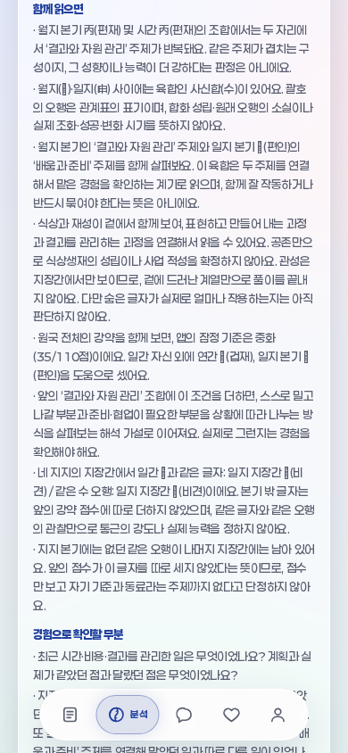
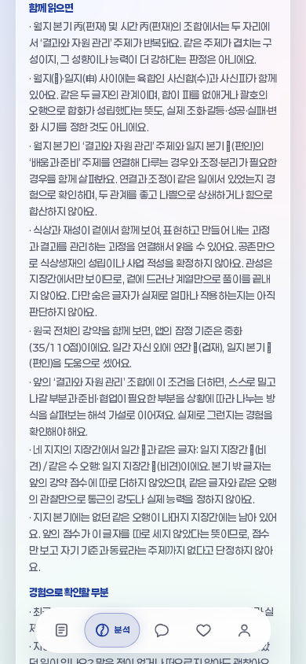
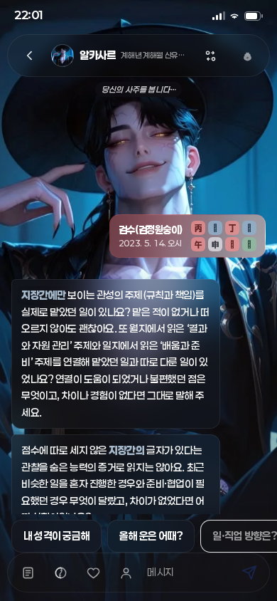
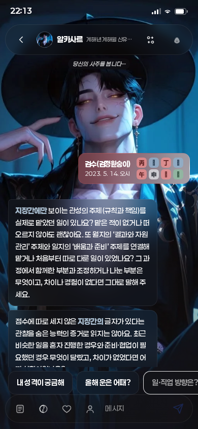

# 같은 월지·일지의 육합과 파를 함께 읽기

## 목표와 범위

생년월일시로 실제 사주를 더 깊게 읽고 입력별 차이를 확인한다. 출처 감사 확대는 목표가 아니다. **개인 적중률은 미측정**이며 아래 검사는 계산·조건·전달의 일관성을 확인한 것이다.

기준: PR #223 merged/main `1b53a24f3ac6dfbdee2867d13f05ed95b628b9f3`, tree `3a5279304626d3699cf01e8cb93e6e90d1485204`. 사용자 원문82. 변경 전 필수8게이트(앱37/37·실제Chromium 포함)를 통과했다.

## 실제 풀이의 변화

기존 엔진은 인해·사신의 같은 월일 육합과 파를 모두 계산했으나 종합문은 육합만 설명했다. `contextReading.js`의 새 `monthDayCompound`는 **같은 두 자리의 육합+파 동시 관찰**만 선택하고 `natal-work-context-v8`로 구별한다. 기존 `monthDayYukhap`/`monthDayChung` 객체와 관계 계산표를 보존한다.

- 두 관계명·글자·본기 주제를 하나의 종합문에서 함께 읽는다. 괄호 오행으로 합화를 확정하거나 합이 파를 없앤다고 하지 않는다. 개인 조화·갈등·성패·시기도 확정하지 않는다.
- 두 주제를 연결해 다룬 경험과 조정·분리가 필요했던 경험을 대조한다. 처음부터 따로 맡은 경우·차이 없음·경험 없음도 질문에 명시한다. 이는 확인할 해석 방향이지 두 관계를 힘으로 합산한 결과가 아니다.
- 기존 두 번째 질문의 관찰 범위 안내는 보존하고 육합 단독 질문 부분만 복합 질문으로 교체한다. 첫/셋째 질문과 총3질문·기존 강약/지장간은 유지한다.
- 단독 육합·충·파, 다른 자리에서만 성립한 관계에는 복합문을 붙이지 않는다. 부분형/완전 삼형·중복지지의 기존 관찰은 유지하되 이번 복합문에는 합치지 않는다.
- 카드→직업근거→모든 자유질문요약→순수서버프롬프트로 동일 설명을 보낸다. 생성·캐시·늦은 답변의 공통 안내는 복합문을 선택하므로 육합 단독 공지를 함께 반복하지 않는다.

## 실제 입력과 검사

`2023-05-14 12:00`은 사신합+사신파, `2024-02-05 12:00`은 인해합+인해파 설명을 받는다. 두 날짜는 실제 사람의 적중 평가가 아니라 **달력 계산을 거친 합성 입력**이다. 전자의 비교 입력 `2025-07-02 12:00`은 같은 임신일주·월/시 계열·35점·지장간 관찰 상태이지만 복합문이 없다. 모든 원국 조건이 같은 두 날짜라고 주장하지 않는다.

새 `test_month_day_compound.mjs`의7검사는 독립7200기호/144월일순서쌍·대상200건, 실제달력, 제3자리/부분형/완전형, KB110행/510모의요청, 주요생성24응답, 잘못된 입력/미상/반환격리와 과거 해시를 확인한다. 알려진102행 중 복합3행의 실제 설명·두번째질문이 바뀌며, 나머지 설명은 동일하다. 새 정책/관찰 필드는 알려진 입력에 추가된다. **미상8행은 데이터 전체동일·요청0**, 계산·Brain·일진·정곡도 비교범위에서 동일하다.

PR223 원래7검사·측정·기대해시는 수정하지 않는다. 기준 커밋의5소스 바이트를 `fixtures/month-day-yukhap-v1/manifest.json`과 `frozen_month_day_yukhap.mjs`로 고정한다. 현재110행의 before해시는 원래PR223의 after해시와 모두 일치한다. 이 고정판은 변경5소스를 동결하며 전체 저장소의 모든 파일을 동결한 것은 아니다.

## 독립 검토

사용자의 같은 모델·최고 노력 평의회 지침으로 읽기 전용 검토를 수행했다. 동시 자식 한도6에서 첫6명을 진행하고7번째를 추가했다.8번째 생성은 전체 스레드 한도로 거절되어 기존 의미 검토자가 별도 출시 검토를 맡았다. **실제7명·8관점이며8명동시가 아니다.** 조건·입력·전달 관점은 반환객체 참조공유를 서로 반박하고 실제 동결 리포트로 재검증했다.

| 관점 | 직접 확인한 근거 | 결과 |
|---|---|---|
| 1 조건·자리 | 독립20,736지지조합·실제7입력, 부분형242·완전형46·중복지지176행 포함 | 신규 차단0; 같은 월일 두 쌍만 선택 |
| 2 문장·질문 | 독립7200기호·실제2복합/단독합/충/무관계 | 신규 차단0; ‘처음부터 따로’ 질문 제안을 채택해 재검사 |
| 3 전달·교차반박 | 동결한 리포트8개·40소비자·190모의응답·190순수프롬프트·미상40요청0 | 신규 차단0; 공유 객체를 수정하는 현재 소비자 없음 |
| 4 역사 재현 | 기준commit5소스 바이트/해시·110행 이전해시·고정/현재7검사·순수프롬프트 | 신규 차단0; 과거 자료와 기대값 보존 |
| 5 입력·격리 | 잘못된73입력·반환22필드 변경·미상50모의경로 | 신규 차단0; 한 반환값 내부 참조공유는 읽기 전용 계약으로 구분 |
| 6 브라우저 | 새 문구 기준320px 폴백·1280px 안내만 있는 자유응답 추가2경로 | 신규 차단0; 질문3개 각1회·가로잘림0·외부요청0 |
| 7 검사 공격 | 단독파·타자리·미상·문장누락4변이 검출, 잘못된 일지역할+측정갱신 변이도 독립기대값 보강 뒤 검출 | 신규 차단0; 검사 공백1건을 보강 |
| 8 출시·인계(2번 검토자 별도 후속) | 보호문서·과거판본·원문append-only·vendor/측정해시·게시범위 | 신규 차단0; 최종 필수검사·원격검사/병합은 PR 영수증 |

## 화면·검증 상태

분석 카드에서 단독합·무관계의 DOM 텍스트/박스는 전후 동일하다. 미상은 상태바 시각을 제외한 DOM 텍스트가 같다. 복합 카드 높이는390px 화면에서2083.984→2125.828px이며 가로넘침은0이다. 독립320px 검사에서 두 번째 질문 높이233.36px, 대화 영역330px로 스크롤/텍스트 경계가 정상이다. 화면 전체의 픽셀 동일성을 주장하지 않는다.

| 화면 | 변경 전 | 변경 후 |
|---|---|---|
| 분석·임신/사신합·파 |  |  |
| 상담·같은503응답의 로컬풀이 |  |  |

새7검사·PR223 고정7검사·순수서버프롬프트는 통과했다. 실제 두 달력의 월/일 본기 글자와 서로 다른 역할은 별도 고정 기대문구로 확인하여, 틀린 역할로 새 측정파일만 갱신해서 통과하는 것을 막는다. 실제Chromium32경로(직업16·비직업12·미상4,390/1280px)의 생성/캐시/지연답변을 모의응답으로 검사한다. 질문 교정 뒤 최종32경로도 통과했고 외부요청·페이지오류·가로넘침은0이다. 최종 필수8게이트/병합 결과는 해당 PR의 단일 영수증이 정본이다. 실제 공급자는 호출하지 않는다.

검수 도구의 상담 after 캡처에서 대화 요소 대기 시간초과1회가 있었다. 앱 오류 원인은 당시 확인하지 못했으며 성공으로 세지 않았다. Vite 캐시를 캡처별로 격리하고 실패 시 DOM/오류를 남기도록 보완한 재실행은 통과했다. 독립 브라우저의 첫 시도도 목록 접두 ‘· ’를 빼먹은 exact 선택자 실패로 제외하고 실제DOM에 맞춘 최종2경로만 통과로 셌다. 이를 제품 버그 수정으로 보고하지 않는다.

## 한계와 다음 작업

- 개인 적중률과 실제 공급자의 의미 해석 품질은 미측정/미검증이다. 실제 합화·통근강도·대운 개인효과·확률학습은 미완료이며 학습적격0·확률null·관리9/20 유지다.
- 같은 반환객체 안의 일부 marker/positions 배열은 공유된다. 현재 소비자는 읽기 전용이며 입력·후속 호출은 독립이다. 새 소비자가 관찰객체를 수정하지 않게 유지한다.
- 기존 자유질문의 전체질문 복제·문장중간 잘림 중복까지 해결한 것은 아니다.
- 다음은 **월일 복합 관계와 함께 관찰된 부분형/삼형의 참여 자리 범위를 구별해 실제 종합문에 연결**하는 한 경로다. 세 자리를 두 자리로 축소하거나 완전형과 부분형을 같다고 확정하지 않는다. 실제 경험과 반대/없음 질문을 유지한다.
- 공개거절 STATUS/WORK_CHECKPOINT는 수정·재전송하지 않는다. 중간 진행은 임시기록, 영구 재개점은 인계와 PR에 남긴다. 영수증만을 위한 재커밋은 하지 않는다.

```bash
node --test docs/knowledge-model/test_month_day_compound.mjs
node docs/knowledge-model/measure_month_day_compound.mjs --check
node docs/knowledge-model/frozen_month_day_yukhap.mjs --test docs/knowledge-model/test_month_day_yukhap.mjs
node --test --test-name-pattern='서버의 순수 프롬프트' scripts/test_app.mjs
CHROMIUM_PATH=/tmp/chromium FONTCONFIG_PATH=/etc/fonts node scripts/test_month_day_compound_browser.mjs
SMOKE_CHROMIUM=/tmp/chromium FONTCONFIG_PATH=/etc/fonts npm run verify
```
