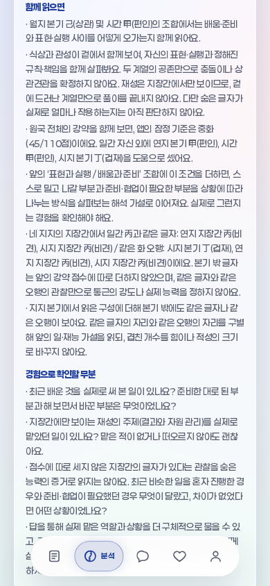
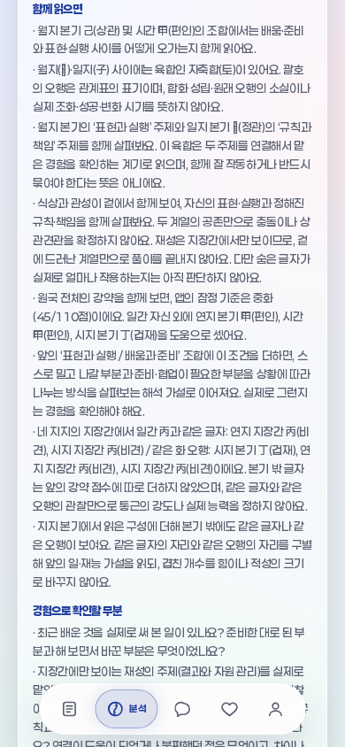
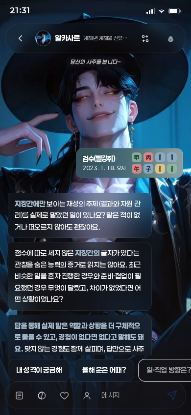
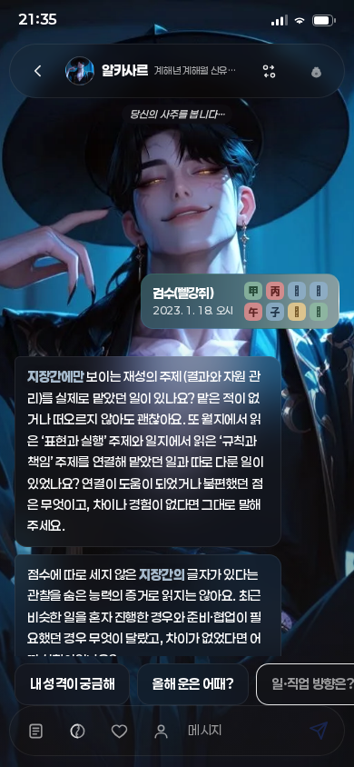

# 월지·일지 육합을 종합 풀이에 연결

## 목표와 범위

생년월일시로 실제 사주를 더 깊게 읽고 입력 조건에 따른 차이를 확인한다. 출처 감사의 확대는 목표가 아니다. **개인 적중률은 미측정**이며 계산·조건·전달 검사와 구별한다.

기준: PR #222 merged/main `22ffd93b20433fa93045bb6618c456598b349c8d`, tree `b30c1a8f7f3d1f5e5acfb8361045f64ace32b3bf`. 사용자 원문81. 변경 전 필수8게이트·앱36/36·실제Chromium을 통과했다.

## 실제 풀이의 변화

`contextReading.js`의 기존 관계 검출에서 **월지·일지 두 자리의 육합**만 읽는다. `monthDayYukhap`은 관찰과 설명을 보존하며 `natal-work-context-v7`로 구별한다. 기존 월일충 객체·풀이, 계산·강약·지장간과 첫·셋째 질문은 유지한다.

- 관찰: 월지와 일지 글자, 기존 관계명. `합(오행)`의 괄호는 관계표의 표기이며 합화 성립·원래 오행 소실을 계산한 결과가 아니다.
- 해석: 월지 본기와 일지 본기의 두 주제를 함께 읽고, 실제로 연결해서 맡았거나 따로 다룬 경험을 확인한다. 합을 조화·성공·길함으로, 충을 실패·흉함으로 나누지 않는다.
- 질문: 기존 두 번째 경험 질문 뒤에 연결·분리·도움·불편·차이 없음·경험 없음 질문을 붙인다. 총3개를 유지한다.
- 실제 현재 본기표에서 육합6쌍은 모두 서로 다른 십성 계열이다. 독립 기호 전수 검사로 확인하며 존재하지 않는 같은계열 육합 분기를 만들지 않는다. 같은계열 충은 기존대로 보존한다.
- 인해·사신은 같은 자리의 파도 기존 관계 목록에 남는다. 이번 문장은 육합만 연결하며 파나 다른 관계를 상쇄·삭제하지 않는다. 여러 관계를 함께 해석하는 설명은 다음 작업이다.

관찰·한계·질문은 카드 → 직업 근거 → 모든 자유질문 요약 → 순수 서버 프롬프트로 전달한다. 생성·캐시·지연 답변에는 앱이 소유한 육합 관찰/한계를 한 번 유지한다. 실제 공급자는 호출하지 않는다.

## 실제 입력 비교와 검사

| 육합 입력(정오) | 비교 입력(정오) | 공통 조건 | 추가 설명 |
|---|---|---|---|
| 2023-01-18 | 2023-07-17 | 병자·월식상/시인성·45점·같은 지장간 관찰 상태 | 자축합 |
| 2023-04-09 | 2024-02-03 | 정유·월식상/시비겁·55점·같은 지장간 관찰 상태 | 진유합 |
| 2023-05-14 | 2025-07-02 | 임신·월재성/시재성·35점·같은 지장간 관찰 상태 | 사신합 |

위 입력은 실제 달력 계산을 거친 **합성 검사 입력**이며 실제 인물·적중 평가 자료가 아니다. 날짜가 다른 두 원국의 모든 조건이 같다는 뜻도 아니다. 별도로 2024-02-05 인해합, 2023-11-05 묘술합, 2023-08-04 오미합까지 육합6종을 확인한다.

신규 `test_month_day_yukhap.mjs` 7검사: 독립7200기호/144월일순서쌍·육합600건, 실제3달력쌍과 육합6종, KB110행/510모의요청, 생성36응답, 미상·잘못된 입력·반환객체 변경 격리, 과거 해시 대조. 생시미상8행 전체동일·요청0이며 알려진102행 중 육합13행의 설명/두번째질문만 추가한다. 계산·Brain·일진·정곡은 비교범위에서 동일하다.

과거 PR222의 원래6검사·측정·기대해시는 변경하지 않는다. `fixtures/month-day-relation-v1/manifest.json`은 기준 커밋의5소스를 고정하고 `frozen_month_day_relation.mjs`가 별도 재현한다. PR221/220의 기존 고정판도 유지한다. 최종 검사·실제 브라우저 경로·독립8관점 결과는 아래 및 PR 영수증에 기록한다.

## 검토와 최종 검증

동일 모델·최고 노력의 읽기 전용 검토를 수행했다. 환경에서 6명 생성 후 추가 생성이 전체 스레드 한도로 거절되어 **실제6명·8관점**이다. 마지막 두 관점은 기존 검토자의 별도 후속 검토이며 8명 동시 검토로 보고하지 않는다. 조건·의미·전달·브라우저 검토자는 서로 결과를 교차 확인했다. 아래 지적·결론은 코드/측정/브라우저로 확인한 범위다.

| 관점 | 직접 확인한 근거 | 판정 |
|---|---|---|
| 1 조건 계산 | 독립24,336기호·144순서쌍, 타자리 육합7,636·동시파676, 이전 전체context 비교 | 신규 차단0; 월일 자리만 선택 |
| 2 의미·질문 | 3,600조합·기존충300·실제6종, 모든 일간에서 본기계열 다름 | 신규 차단0; 길흉·합화 단정 없음 |
| 3 소비 경로 | 실제KB·8날짜·136생성/자유응답 및 순수서버프롬프트, 미상40호출 차단 | 신규 차단0; 생성문 의미 품질은 미검증 |
| 4 역사 재현 | 기준commit과5고정소스 바이트 일치, 원래6검사 통과,110개의 before해시=이전after해시 | 신규 차단0; 전체저장소 동결은 아님 |
| 5 입력·변경 격리 | 잘못된132입력·20,736기호,80미상호출 요청0,144달력경계 입력 | 신규 차단0; 계산/충/첫·셋째 질문 보존 |
| 6 브라우저 | 기본32/32, 기존84+새28 안내 각1회, 추가5경로(도입직후·자유질문·320/375/390폭) | 신규 차단0; 둘째질문190자는330px 대화창 안에 표시 |
| 7 테스트 공격(4번 검토자의 별도 후속) | 별도 쌍/본기오행 oracle·7,200기호, 충삭제/질문변조/없는육합주입6반례 모두 검사가 거부 | 신규 차단0; 생성36은 주요 사례 수이며 모든 모의요청 합계가 아님 |
| 8 출시·인계(2번 검토자의 별도 후속) | 보호문서·구판자료 보존, 현재 영수증·검사로그·비밀키패턴 후보0·원격기준 대조 | 신규 차단0; 최종훅/원격검사/병합은 PR 영수증 |

실제 Chromium32경로는 직업16·비직업12·미상4,390/1280px에서 외부요청·페이지오류·가로넘침0이다. 생성응답은 전부 모의이며 실제 공급자 호출0이다. 별도5경로로 본문 전 응답과 자유질문의 관찰문만 있는 답변을 확인했다. 긴 두 번째 질문은390/375폭에서209.9px,320폭에서256.8px 높이로330px 대화창에 들어갔다.

전후 분석 DOM에서 육합 없는 입력의 설명·박스 크기는 동일하다. 미상 화면은 상태바 시계(21:30→21:35)를 제외한 DOM이 같으며, 화면 전체 이미지의 바이트 일치를 주장하지 않는다. 캡처 도우미를 이전 사례에서 가져오는 동안 잘못된 질문 선택자로 한 번 시간초과가 났고 실제 현재 질문으로 교정해 전후 재실행했다. 앱 결함이 아니다. 임시 이미지 동일성 검사의 시계 차이도 실제 DOM으로 확인했고 이미지 변경으로 숨기지 않았다.

| 화면 | 변경 전 | 변경 후 |
|---|---|---|
| 분석·병자/자축합 |  |  |
| 상담·같은503응답의 로컬풀이 |  |  |

현재7검사·PR222 고정6검사·순수서버프롬프트·현재측정 재현과 브라우저 결과는 통과했다. 최종 활성훅의 전체8게이트·원격 최신head검사·병합/main/tree 대조는 PR의 단일 영수증이 정본이다. 생성된 lock 차이와 임시 `_val.mjs`는 기능 변경에 포함하지 않는다.

## 한계와 다음 작업

- 개인 적중률, 실제 공급자의 의미 해석 품질, 합화·강도·시기·대운의 개인효과, 확률 학습은 미측정/미완료다. 학습적격0·확률null·관리9/20 유지.
- 정확한 전체 문장/분리 문장 복제는 검사한다. 기존 자유질문의 전체질문 복제·문장중간 잘림 중복까지 해결했다고 보고하지 않는다.
- 다음: **같은 월일 자리의 육합과 파/형 등 동시 관찰을 종합문에서 함께 읽기**. 특히 인해·사신의 육합과 파를 함께 표시하고 단일 길흉·상쇄·강도 판정으로 바꾸지 않는다. 검토된 계산표·자리 범위를 재사용하고 실제 경험 질문에 연결한다.
- 공개가 거절된 STATUS/WORK_CHECKPOINT는 수정·재전송하지 않는다. 재개 지점은 인계와 PR, 실행 중 기록은 임시 파일에 둔다. 병합 영수증만을 위한 재커밋은 하지 않는다.

```bash
node docs/knowledge-model/measure_month_day_yukhap.mjs --check
node --test docs/knowledge-model/test_month_day_yukhap.mjs
node docs/knowledge-model/frozen_month_day_relation.mjs --test docs/knowledge-model/test_month_day_relation.mjs
node --test --test-name-pattern='서버의 순수 프롬프트' scripts/test_app.mjs
CHROMIUM_PATH=/tmp/chromium FONTCONFIG_PATH=/etc/fonts node scripts/test_month_day_yukhap_browser.mjs
SMOKE_CHROMIUM=/tmp/chromium FONTCONFIG_PATH=/etc/fonts npm run verify
```
