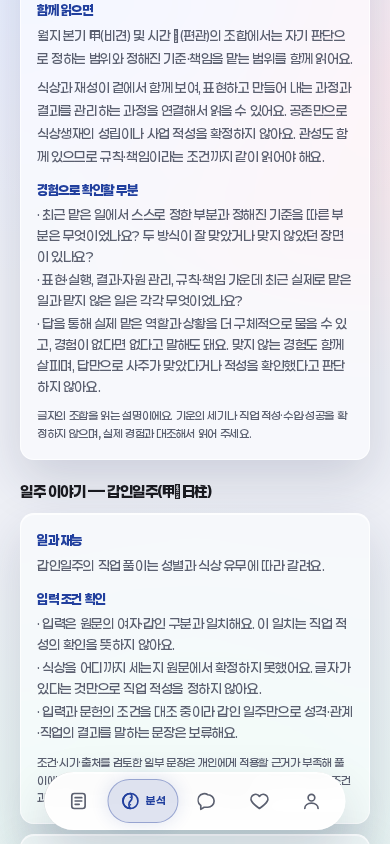
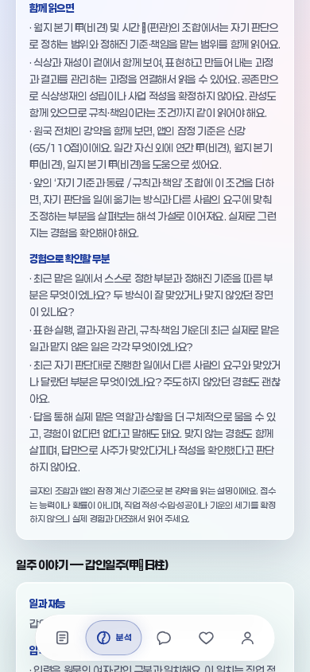

# 원국 전체의 강약 조건을 일·재능 종합문에 연결

2026-09-29 · 사용자 원문77 · 기준 PR218/main `513226cfce058b4135102b539cb4371dbb05c8bb`

**상시 목표: 생년월일시로 실제 사주를 더 깊이 풀고, 계산 검증·풀이 조건 검증·개인 적중률을 구별한다. 개인 적중률은 미측정이다.**

## 실제로 달라진 풀이

이전에는 월지 본기/시간의 조합과 식상·재성·관성 구성만 종합문에 연결됐다. 이번에는 기존 `strengthJudge`가 도움으로 센 자리·글자와 잠정 강약 조건을 함께 설명한다. `natal-work-context-v3`는 원래 두 종합문 뒤에 **계산 관찰**과 **해석 가설**을 붙이며 경험 질문은2→3개다. 계산값·자리배점·5분류 경계·득령/득지/득시/득세는 변경하지 않았다.

보정 끔·`keepDay`·12:00·여성 입력의 실제 달력 비교:

| 입력 | 연/월/일/시 | 기존 잠정 계산 | 이번 설명 |
|---|---|---|---|
|2011-02-28|신묘/경인/갑인/경오|신강65/110|자기 판단을 실행하고 다른 요구에 맞춰 조정하는 방식을 확인하는 가설|
|2026-02-09|병오/경인/갑인/경오|중화55/110|스스로 진행할 부분과 준비·협업이 필요한 부분을 상황에 따라 나누는 가설|
|2024-02-20|갑진/병인/갑인/경오|신강65/110|같은 신강 가설, 도움으로 센 글자·자리는 다름|
|2023-02-25|계묘/갑인/갑인/경오|극신강85/110|신강과 같은 가설 묶음, 실제 분류·점수·근거는 극신강으로 표시|

첫 두 입력은 **월·일·시주가 전부 같고 연주만 다르다**. 예전 월·시 종합문은 같았지만 이제 전체 조건에 따른 가설·질문이 다르다. 네 사례 모두 같은 갑인이며 월지 본기 비견/시간 편관 조합이다. 전체 월주가 네 사례 모두 같은 것은 아니다.

강약5분류를 강/중간/약3묶음으로 읽는다. 신강/극신강·신약/극신약은 각각 같은 가설을 사용한다. 근거·점수만 달라지는 입력도 있으며 이를 정교한25×5 독립 해석 규칙으로 보고하지 않는다. 약한 묶음은 준비·협업과 감당 범위를 물으며 혼자서도 무리 없었거나 차이가 없는 경험을 허용한다. 강한 묶음도 주도하지 않았던 경험을 허용한다.

## 근거의 범위와 전달

- [기존 강약 교정](FOUNDATION_STRENGTH_CORRECTION.md)의 잠정 계산을 재사용한다. 비겁/인성을 도움으로 세며 지지는 마지막 본기만 사용한다. 일간 자신10점은 계산에 포함되지만 ‘일간 자신 외’의 도움 목록에는 제외한다. 나머지 지장간·통근의 강도는 새 점수로 만들지 않는다.
- 해석은 확인할 질문을 정하는 **구현 가설**이다. 신약=능력 부족, 신강=직업 성공으로 판정하지 않는다. 학습 적격0·확률null, 관리9/20은 유지한다.
- 기존 카드/컴포넌트·디자인 값을 계승한다. 카드→직업상담의 근거→모든 자유질문의 원국요약→서버 텍스트 프롬프트로 관찰/가설/질문/한계를 전달한다.
- 생성 답변에는 앱이 소유한 잠정기준 안내와 직업 후속 질문을 유지한다. **실제 공급자가 강약 관찰·가설을 정확히 해석하거나 같은 문장으로 재서술하는 것은 보장·검증하지 않았다.** 네트워크 전송 모의 검사와 개인 정확도 평가는 별개다.
- 생시미상 공통보류·요청0, 프로필/화자/주제 분리·retry snapshot·부분 타이핑/늦은 답변 정책은 그대로다.

## 검증과 수정 경위

- 작업 시작의 전체8게이트를 실제 Chromium 포함 통과했다. 새6검사는 독립128도움 패턴/5분류·네 달력입력·미상/오염·현재KB110행/510모의요청·생성답변·새측정 일치를 검사한다. 알려진102행은 context 카드/직업 근거/요약만 바뀌고 원국·조회키·Brain·일진·정곡은 동일, 미상8행은 전체동일·요청0이다. 훅의 리포트/카드도 현재 리포트/카드와 정확히 같은지 정규화 전에 검사한다.
- 현재6검사와 별도로 **서버의 순수 프롬프트 함수**를 TypeScript AST에서 그대로 추출해 네트워크 API가 없는 VM에서 실행한다. 실제 `buildUserMessage`와 상한 상수를 쓰며 핸들러·자격·공급자를 호출하지 않는다. 두 달력입력×직업/자유질문·최대 가까운 대화7992자에서 조건/질문/한계가 유지된다.
- 처음 만든 신규 핸들러 통합검사 후 대기 요청은 자동 승인 검토가 외부 Anthropic 요청 위험으로 거절했다. 해당 검사는 제거했고 외부 경로를 재시도하지 않았다. 이를 통과로 세지 않으며 위 순수 함수 검사로 대체했다. 실제 외부 공급자 품질은 미검증이다.
- 첫 신규6검사는4통과/2실패였다. 수기 기대값75를 실제65로 바로잡고, 발생 불가능한15점 대신 도달 가능한10/20 경계를 검사했다. 계산 구현을 검사값에 맞춰 바꾸지 않았다. 순수 함수 검사의 초기 대화는 메시지당2000자 상한을 넘겨 파서가 제외했고,7992자/개별1998자의 유효 경계로 교정했다.
- 읽기전용 검토에서3문장으로 늘린 안내가 늦은 비직업 답변에서 두 조각으로 나뉘고 전체 안내와 중복되는 것을 확인했다. 의미를 유지한2문장으로 정리하고 `test_strength_notice_browser.mjs`의 실제 Chromium4경로(390/1280×선택직후/도입후)에서 안내/각 핵심절1회를 검증한다. 기존 직업 지연검사도 세 번째 질문1회·순서를 검사하도록 보강했다.
- 독립 브라우저24경로: 카드6·미상2·직업응답12(로컬/빠른도착/강약본문후/첫질문후/셋째질문후/캐시)·늦은성격4. 각390/1280px, 오류·가로넘침0, 질문3개 각각1회·순서 유지, 세 번째 질문이 후속 대화 맥락에도 남는 것을 확인했다.
- 기존 v2 네 context 파일은 PR217/218의 원래 blob과 바이트 일치한다. 현재 소비자 복사본에 네 파일만 덮어 **새 설명 전후**를 비교하며 원래110개 baseline 해시는 보존 v2 측정과 전부 같다. 과거 자료·기대해시는 덮지 않았다. PR217/218 무맥락 검사는 `node docs/knowledge-model/frozen_conversation_context.mjs scripts/check_conversation_consumers.mjs`로 원래 판본을 재현하고 현재110은 새6검사가 별도 담당한다.

최종 활성 커밋훅8게이트·원격최신head 검사·병합/main/tree는 PR 본문에 단일 영수증으로 남긴다. 공개 거절된 STATUS/WORK_CHECKPOINT는 수정·재전송하지 않는다.

## 화면 전후

390px 실제 앱 분석의 같은 위치를 캡처했다. 텍스트/문단 수만 바뀌며 디자인값은 변경하지 않았다.1280px와 갑오/갑자·생시미상도 비교한다. 화면·DOM 측정은 [evidence/strength-context](evidence/strength-context)에 보존한다.

| 변경 전 | 변경 후 |
|---|---|
|||

## 독립8관점 검토

같은 모델 최고 노력8관점이며 동시 한도 때문에6+2로 진행했다. 실제8명 동시 실행으로 보고하지 않는다. 직접 재현된 지적만 채택하고 마지막2관점이 교정을 적대 검토했다.

| 관점 | 직접 확인·반영 |
|---|---|
|1 계산|독립10일간×128패턴·14400자리 조합·64미상/오염 검사. 불가능15점 테스트를10/20으로 교정, 런타임 차단0|
|2 의미|수기75→65·범위을→범위를 교정. 월·일·시가 같은 실제 두 사례 확인.5분류/3가설·개인정확도 미측정 구분|
|3 소비/API|새 조건의 요약/근거 전달 확인. 늦은 비직업 안내 중복을 재현해2문장 교정. 생성 모델의 동일 서술은 미보장|
|4 과거 재현|4fixture 원본 바이트·110baseline 해시 일치, 전후 재현 중 기존 자산 불변. 문구 확정 후 새측정 재생성|
|5 검사 적대|서버 함수 검사와 훅/카드/안내 정확한 대응을 보강. 검사의 범위를 실제 공급자 검증으로 부풀리지 않음|
|6 실제 화면|Chromium24경로 통과,3질문·대화맥락·늦은 성격 안내1회·가로넘침/오류0|
|7 수정본 런타임|6현재검사+순수프롬프트1 재실행·정본/vendor·지원/미상경계·교정본 확인. 잔여 차단0|
|8 수정본 전달|현재소스5해시·4fixture·110baseline 및 전달·범위 재확인. 옛직접검사 대신 고정판본 명령 명시|

## 다음 작업과 한계

[인계 §5.1](FOUNDATION_HANDOFF.md): 지지 본기만 쓰는 현재 강약 계산 옆에, 다른 지장간에서 같은 글자·같은 오행이 관찰되는지를 구분해 읽게 한다. 통근 정의의 판본 차이·힘/개인효과를 몰래 확정하지 않고 기존 점수도 임의 변경하지 않는다.

전체60일주의 정교한 종합 해석, 자리 역순 조합의 의미 차이, 통근·합충·대운 개인효과, 실제 공급자 의미 준수·개인 적중률·확률학습은 남는다. 테스트 통과·표본 수를 해석 정확도로 바꾸지 않는다.
