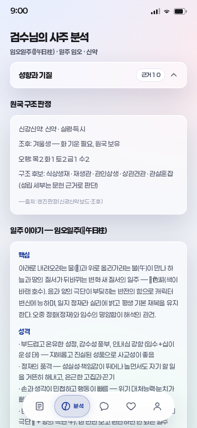
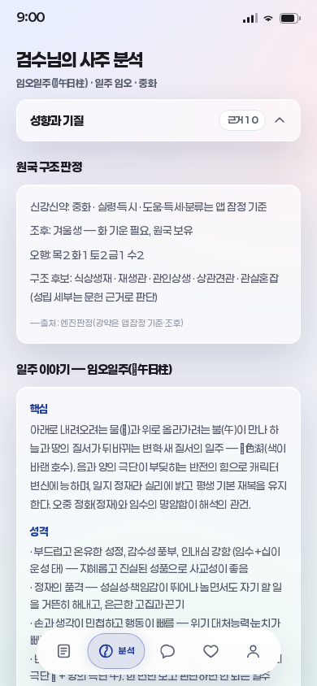

# 강약 자리배점 최소 교정

2026-09-28 · 사용자 원문59 · 기준 PR #203/main `006d06c7bb0ee5281ebe94a170688709c48094db`.

## 1. 변경과 근거의 범위

기준 main의 tree `9af1bfbbd1dd8167ec854a0d38df74e779346fb2`와 PR #203 병합을 대조한 뒤 인계의 다음 작업을 진행했다. **연지15→10·시지10→15**만 교정한다. 월지30·일지15·천간각10·일간포함·총110, 도움 오행·마지막 본기·득세·5등급 경계는 기존 앱의 잠정 정책을 유지한다. 이 수치를 학습값·확률·전체 보드 강약정책의 인증으로 표시하지 않는다.

[기존 원문17구간](data/foundation_calculation_review.json)의 `board_coordinates`·`board_markers`를 다시 읽었다. `dosa-app/methodology/figjam_board_raw.txt`의 LF2032~2043에서 시/일/월/년 헤더 x2083/2244/2405/2566과 지지 배점 x2152/2311/2470/2632는 각각15/15/30/10이다. LF2082의 일간10도 보존된다. 이전 전사041/179/186은 보강자료이며179/186은 같은 강의의 파생본이고 ASR 미검수다.

보드30/45/60 표식만으로 ≥85·≥60·>30·>15의5등급 전체를 확정할 수 없다. 다른 저자의100점제나 경계를 섞지 않는다. 근거 귀속·원인 설명은 [F03 원문 검수](FOUNDATION_CALCULATION_POLICIES.md)와 [소비 경로 검수](FOUNDATION_STRENGTH_CONSUMERS.md)의 한계를 따른다.

| 항목 | 교정 전 | 교정 후 |
|---|---|---|
| 연지/시지 |15/10|10/15|
| 월지/일지·천간·총점 |30/15·각10·110|동일|
| 도움·득세·분류 경계 |기존 앱 정책|동일, 잠정 기준 명시|
| 리포트 배점 문구 |별도 하드코딩|계산이 쓰는 동결 상수에서 생성|
| 카드·상담·정곡 근거 |보드 판정처럼 읽힐 수 있음|자리 배점과 앱 잠정 분류를 구별|
| 생시 미상 |`withhold-unverified-v1` 보류|동일|

정본은 `dosa-app/engine/src/judge.js`·`report.js`이며 vendor는 `npm run sync:engine`으로 생성했다. `keyset.js`의 구조 판정 경로와 앱 `jeonggokRaw`의 직접 경로는 같은 수정된 함수를 사용한다. 계산 설명도 같은 상수를 읽어 숫자가 다시 갈라지는 것을 막는다.

## 2. 전후 검증과 보존 판본

[재현기](measure_strength_correction.mjs)·[새 측정](data/foundation_strength_correction.json)·[회귀](test_strength_correction.mjs)는 수정 전/후 실제 앱을 고정 평가시각 `2026-09-28T00:00:00Z`와 같은 실제 KB/Brain 자산으로 실행한다. 현재 Node24.19·ICU78.3·tz2026b에서 확인했다. 해시와 전체 출력 비교가 기준이며 이 환경을 모든 브라우저/시간대 검증으로 확대하지 않는다.

`fixtures/strength-position-v1`에 기준 main의 정본judge/report·vendor2개·saju/jeonggok6개를 별도 보존했다. 여섯 파일 모두 기준 Git blob과 바이트 대조했고 manifest에 LF해시를 둔다. `frozenApp({consumers:'unknown-time-v1'})`는 PR #203 이후 보류 계약과 교정 전 배점을 재현한다. 기본 legacy 모드는 여기에 기존 `app-consumers-v1`7개를 겹쳐 과거 감사를 재현한다. 정본 engine/src와 app/src는 임시 실복사본이므로 덮어쓰기가 현재 코드로 전파되지 않는다.

원래 F03·시간대·48행 측정과 원문·해시, `app-consumers-v1`은 변경하지 않았다. 과거 검사 해시를 새 정책에 맞춰 덮은 것이 아니다. 새 측정은 이전48행의40개 알려진 입력과8개 미상을 그대로 사용한다.

| 범위 | 결과 | 의미 |
|---|---:|---|
| 합성 도움128패턴 |점수64·라벨14 변경, ±5, 도움/득세 변화0|자리 산술 전수. 달력상 인물 표본 아님|
| 알려진 시각40조건 |점수34·라벨22 변경|경계 중심 검토 입력. 사용자 변경률·정확도 아님|
| 조회 키·Brain |라벨이 바뀐22조건의 강약 키와 대응 조회 변화|동일 자료에서 새 키로 조회; 새 지식/학습값 추가 아님|
| 리포트/카드/상담요약 |40조건의 강약 문장·잠정 출처 갱신|점수가 같은 조건도 출처 문구 변경|
| 직접/공유 훅 정곡 |40조건 최종선택 동일|다른 시기 후보가 우선됨; 모든 입력의 불변을 뜻하지 않음|
| 생시 미상8조건 |전후 전체 객체 동일|정오 재도입·개인 근거·공급자 호출 없음|
| 차트·오늘운세·주제5종 |40조건 전체 객체 동일|이 회귀 범위의 무관한 결과 보존|

전체 비교에는 프로필/공유 왕복, 차트, 원시정곡, 정본조회키, 리포트, 풀이, Brain, 일진, 상담요약·주제5종과 실제 `useReport`의 React SSR 실행을 포함한다. 독립 산술은 상수/도움값을 복사하지 않고 오행 인덱스에서 계산한다. Brain은 변경되지 않은 자산에서 교정된 키로 별도 재구성한다. 최종 전체 객체 해시도 저장한다.

극단 강약 후보는 위40조건에서 최종선택되지 않으므로 별도 **합성 선택기 입력**으로80/85·15/20의 후보 유무, `INFER`, 잠정 근거 문구를 검사한다. 실제 원국이나 학습 라벨로 쓰지 않는다. 보고문·카드 라벨이 실제 계산 라벨과 같은지도 직접 검사한다.

기존 생시 미상 계약7검사의 미상/낡은리포트/거짓가드/취소 검사는 유지한다. 알려진40입력의 기대값만 명시적인 새 정책으로 전환했고 기존 가상 배점 비교값과도 대조한다. 새7개·현재미상7개·과거소비5개는 필수7번 게이트에서 실제 실행 수·통과 수·스킵0을 강제한다.

## 3. 화면 전후

390×844 실제 Chromium 화면에서 알려진 입력과 미상 입력의 결과·분석·상담6경로를 비교했다. 모든 화면에 가로넘침·페이지오류가 없다. 알려진 분석은2024-01-19 16:00 서울·보정켬·midnight23의 신약30→중화35 사례다. 기존 디자인 값·구조를 유지하고 라벨·근거 문구만 변경했다.

| 전 | 후 |
|---|---|
|||

다른5화면의 DOM 텍스트·측정좌표는 동일했다. 결과2개와 미상분석 PNG는 바이트상 픽셀 동일이다. 상담2개의 소량 픽셀 차이는 기존 `msd-shim` 반복 효과 위치에 한정되며 최대 채널차이는 알려진입력3/255·미상10/255다. 텍스트·배치는 동일하다. 상담 검사에서는 외부 공급자 응답을 검증하지 않았으며 실제 AI 품질은 이 작업의 검증범위가 아니다.

## 4. 독립 검토와 필수 검사

사용자 요청에 따라 동일 모델·최고 추론설정의 읽기 전용 검토8관점을 진행했다. 환경이 동시 자식6개만 허용해6+2로 나눴으며8명 동시 실행으로 보고하지 않는다. 서로의 지적을 적대 검토에 전달하고 직접 재현한 것만 반영했다.

| 관점 | 직접 확인한 내용·지적 | 반영 |
|---|---|---|
|1 원문·귀속|보드좌표·17인용·23보존해시·6기준blob 일치|자리 교정/잠정 전체정책 구별|
|2 독립 산술|별도 지지 오행표와 기준Git 함수로128/40 재계산|64/14 및34/22, 나머지 구조 동일 확인|
|3 소비 경로|상담요약은 markdown을 제거해 원문 그대로의 문자열 교체가 실패|검사 기대값의 강조표기 제거 수정, 재검사 통과|
|4 고정판본|임시트리70개 기준파일·실제 구함수 import·타임아웃 자식종료/정리|과거 해시·결과 유지, 원본으로 쓰기 전파 없음|
|5 검사 계약|스냅샷만으로 화면 라벨/극단 후보 문구 오류를 놓칠 수 있음|라벨 직접 일치·합성 극단후보7번째 검사 추가|
|6 미상/부작용|낡은리포트·false/null의25독립 주제검사, 공급자0·낡은근거getter0|보류 계약 유지|
|7 시각|실제6화면·DOM·PNG 비교|라벨/근거 변경 외 DOM동일, 가로넘침0|
|8 적대·교차|상수 import 의존관계·전체객체 비교 허용범위·다른7관점 근거 대조|잔여 차단사항 없음; SSR와화면·표본과정확도 구별|

재현:

```bash
npm run build
node docs/knowledge-model/measure_strength_correction.mjs --check
node --test docs/knowledge-model/test_strength_correction.mjs
node --test docs/knowledge-model/test_unknown_birth_time.mjs
node docs/knowledge-model/frozen_app_audit.mjs docs/knowledge-model/measure_strength_consumers.mjs --check
SMOKE_CHROMIUM=/path/to/chromium npm run verify
```

검사 도중 신규 전체객체 비교의 초기 JSON출력은 파이프 버퍼 한도를 넘었다. 임시파일 전달로 바꿨으며 성공·실패 모두 정리한다. 초기 환경의 브라우저 미설치는 실제 Chromium을 마련해 해소했다. 최종8게이트·커밋훅·원격최신head·병합 영수증은 해당 PR 본문을 확인한다. 원문/코드 재현은 실제 사주 해석 정확도를 인증하지 않는다.

## 5. 다음과 한계

다음 첫 작업은 [인계 §5.1](FOUNDATION_HANDOFF.md)의 **월률분야·사령 기간 판본 검수**다. 원문 기간표·구성/본기·절입 경과시간·기산점을 구분하고 충돌을 해소할 근거가 없으면 후보와 보류를 유지한다. 이후 현침살 판본·F04 P2/D5·기본풀이 검수로 이어간다.

생시 미상 공통값/범위, 연구v2 브라우저 연결, 전체 시간대·기간 검증, 출처별 완전 강약정책, 개인 해석 정확도·실제학습/확률보정은 미완료다. 검색282·기본그래프58/132/11·조건8·출처조회10/52/12/9/21·학습적격0·확률null은 유지한다. 기존 STATUS/WORK_CHECKPOINT는 이전 공개 거절에 따라 변경·재전송하지 않았다. 중간 임시기록을 남겼고 최종 재개 범위는 이 문서와 인계, 실제 완료는 PR영수증으로 확인한다.
