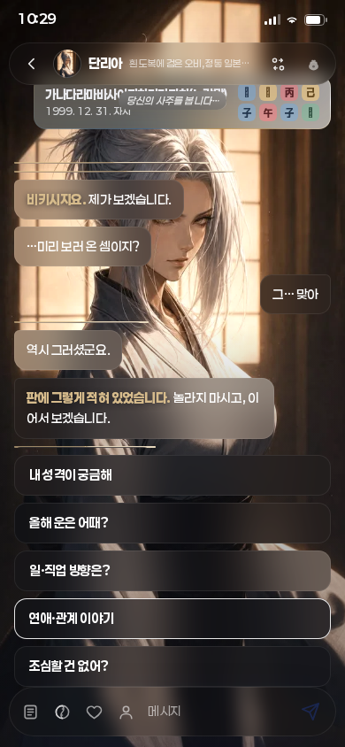
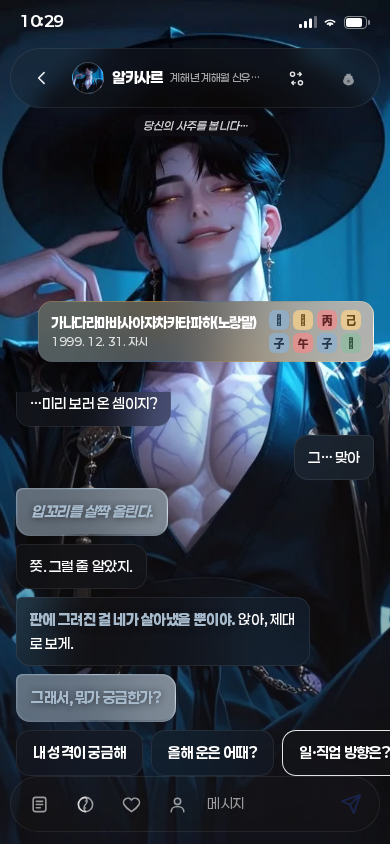
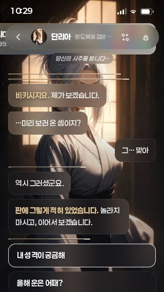
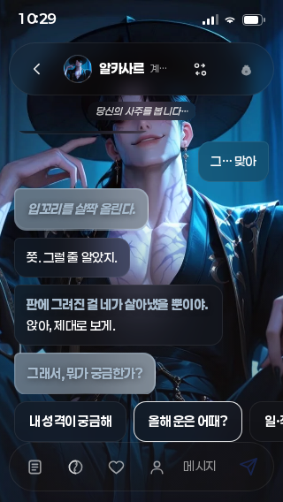

# 2026-09-22 대화형 앱 기반 정리

`Saju_handoff_20260922.zip`의 미완료 수정본을 연결된 `muteno/Saju` 저장소에서 이어받았다. 목표는 사주 알고리즘 재구축에 앞서 캐릭터와 대화하는 앱의 입력·저장·상담 흐름을 정리하는 것이다. 기존 화면 구성과 디자인 토큰을 사용했다.

**알고리즘 재구축은 아직 착수하지 않았다.** 기존 계산 결과나 해석의 정확도를 이번 작업으로 보증하지 않는다. 기준 커밋은 `8a3adc84c32199be0b06427d36a99bbdfad12be0`이다. 이 보고서 작성 시 병합·배포 완료는 확인되지 않았다.

## 반영한 동작

| 영역 | 변경 및 결과 |
| --- | --- |
| 프로필 저장 | 손상된 항목을 건너뛰고 유효한 프로필을 복원한다. 저장 공간 오류 후에도 세션 내 편집·삭제가 유지된다. 기존 프로필 편집은 같은 ID로 저장한다. 계산이 성공한 뒤 저장한다. |
| 공유 결과 | 이름·생일만 같아도 시간·성별·도시·보정 옵션·시간 미상 여부가 다르면 다른 사람의 사주로 식별한다. 잘못된 공유 시각을 거절한다. |
| 시간 미상 | AI 요약에서 임시 시주와 강약 판단을 제외하고 한계를 알린다. 인계본의 필터가 `시`를 비교하던 오류를 실제 엔진의 `시주`에 맞췄다. 실제 엔진 리포트를 사용한 회귀 검사를 추가했다. |
| 질문 전송 | 통신을 `dosaClient.ts`로 분리하고 취소·시간 제한·중복 전송 방지를 적용한다. 대화 상태가 바뀐 뒤 도착한 응답을 현재 대화에 붙이지 않는다. 취소된 선행 요청은 다시 요청할 수 있다. |
| 대화 조작 | 한글 조합 확정 Enter와 Shift+Enter의 오전송을 막는다. 실패한 질문은 재시도할 수 있고, 다음 대사 버튼과 입력 중 화면 배치를 정리했다. React StrictMode에서 초기 캐릭터 교체 신호가 중복 실행되지 않도록 마지막 신호를 비교한다. 입력창에 초점을 둬도 여백의 높이를 유지하고 작은 화면의 선택지 폭을 정리했다. |
| API 입력 | null·배열·원시 JSON·과도한 질문을 검증하고 모델/캐릭터의 상속 속성 우회를 차단한다. 상위 요청 취소와 전체 호출 시간 제한을 적용한다. 잘못된 공급자 응답은 폴백한다. |
| 오류 안내 | 지식 데이터 적재 실패 안내와 재시도 버튼이 기존 색상 토큰을 사용하도록 정리했다. |
| 품질 게이트 | `npm run test:app`을 추가했다. 기존 게이트를 유지한 채 앱/API 회귀를 `verify`의 7/8단계, 브라우저 스모크를 8/8단계로 연결했다. |

## 확인한 범위

| 검사 | 결과 |
| --- | --- |
| 기존 만세력 엔진 픽스처 | 19건 통과 |
| 앱·상담 API 회귀 | 13건 통과: 프로필 복구·저장 실패·수정, 공유 식별·시각 검증, 시간 미상, IME, 요청 취소·시간 제한, API 검증·폴백 |
| 시주 노출 회귀 재현 | 올바른 fixture와 실제 엔진 검사 추가 시 3건 실패를 확인했고, 필터 수정 후 13건 전체 통과 |
| 디자인 토큰·vendor 동기화 | 통과 |
| 증류 인용 검증 | 79개 파일·223개 인용 통과 |
| 지식 시험은행 리플레이 | 누락 원문 복원 후 PASS 시트 1개·질문 1건 재적중 |
| 프로덕션 빌드 | TypeScript·Vite 빌드, KB 번들 동봉, 표준 `backdrop-filter` 확인 |
| 실제 브라우저 스모크 | Chromium으로 홈·원국·분석·상담 렌더, KB 적재, 기본 글자/터치 영역 검사 통과. 브라우저 없음 스킵을 사용하지 않음 |
| 앱 린트 | 통과, 기존 경고 10건 잔존 |
| 최종 전체 `npm run verify` | `SMOKE_CHROMIUM=/tmp/chromium npm run verify` exit 0, 8개 게이트 전체 통과. 브라우저 스킵 없음 |
| 모바일 전후·상태 전환 검수 | 실제 브라우저 10/10건 통과(exit 0). 390×844·320×568·390×420 레이아웃과 입력 초점, 초기 화자, IME·중복 전송·재시도, 화자/프로필 변경 및 화면 이탈 요청 취소, KB 오류·복구 확인 |

최초 전체 검사에서 시험은행 원문 `youtube-tools/book/fulltext/JMCgXyFr2hg.txt`가 작업 사본에 없어 리플레이만 실패했다. GitHub 원본 blob을 복원했고 Git SHA `fb25eae1ea01552cac468890f6cd0e652d3a985b`의 일치를 확인했다. 테스트 패턴이나 통과 기준은 바꾸지 않았다.

상담 브라우저 회귀는 빌드 후 `CHROMIUM_PATH=/tmp/chromium npm run test:chat`으로 재실행한다. 실행 환경에 설치된 Chromium의 실제 경로를 사용한다. AI 응답은 테스트가 모킹한다.

상담 검수는 실제 KB(색인 598키·증류 79개)를 적재했다. 실패한 질문을 다시 보낼 때 사용자 말풍선이 중복되지 않고, 주제 메뉴로 돌아가면 재시도 상태가 지워지는지 확인했다. 질문 요청뿐 아니라 선행 주제 요청도 화자 변경과 화면 이탈 때 취소되는지 검사했다. 결과 원본 = [browser-results.json](20260922_conversation_foundation/browser-results.json).

## 전후 화면

새 버튼 배치: `다음 이야기 / 한 번에 보기`는 대화 로그 아래 오른쪽에 기존 반투명 버튼 모양으로, `질문 다시 보내기`는 실패 때 입력행 위에 기존 선택지 모양으로 배치했다. 이 화면 변경은 별도 커밋으로 분리했다.

정상 KB가 적재된 기준본과 수정본에 같은 대표 프로필을 사용했다. 기준본의 초기 화자 교체 오류 때문에 전후 캐릭터는 다르다. 수정본에서 프로필과 헤더가 겹치지 않고 320px 폭에서도 입력행이 화면 안에 들어오는 것을 확인했다.

| 화면 | 수정 전 | 수정 후 |
| --- | --- | --- |
| 390×844 |  |  |
| 320×568 |  |  |

## 남은 범위

- AI 응답과 오류는 모킹으로 검증했다. 실제 공급자 호출, 운영 자격 설정, 선택 모델의 가용성, 실제 응답 품질은 확인하지 않았다.
- 엔진 19개 픽스처는 기존 구현의 제한된 회귀 검사다. 전체 출생 시각·역사적 표준시·서머타임·절기 경계·시간 미상 계산의 정확성을 확립하는 정답 세트가 아니다.
- 시간 미상은 기존 엔진에 정오를 대입하고 시주 의존 결과의 노출을 제한한다. 실제 3주 계산 모드를 구현한 것이 아니며, 절입일의 연·월주는 확정되지 않을 수 있다.
- 프로필은 기기 로컬 저장소 기반이다. 계정 간 동기화와 대화 이력 서버 저장은 이번 작업에 포함하지 않았다.
- 키보드 대응 검사는 390×420의 줄어든 뷰포트에서 입력창에 초점을 주는 방식이다. 실제 iOS/Android 소프트 키보드·안전 영역·운영 네트워크·운영 배포는 확인하지 않았다.

다음 단계는 사주 계산의 정답 데이터와 경계 조건을 먼저 정하고, 계산 계층과 AI 서술 계층의 계약을 유지하면서 알고리즘을 재구축하는 것이다.
